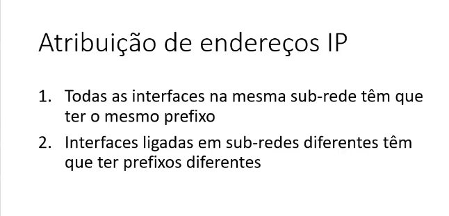
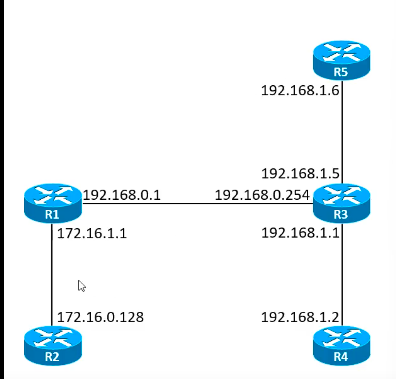
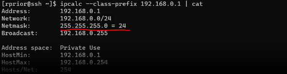
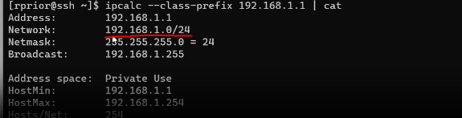
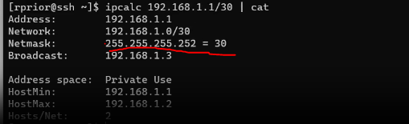
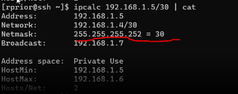

# Apontamentos do video sobre como determinar comprimentos de prefixo

## Atribuição de endereços IP (requisições)

## Exemplo 

### Interface entre R1 e R2

    ipcalc --class-prefix 172.16.1.1

Como o **HostMin = 172.16.0.1** e **HostMax = 172.16.255.254** temos que:

+  O **primeiro requesito** é satisfeito (R1 e R2 tem as interfaces com ip abrangido)

+ O **segundo requesito** também é satisfeito, porque **não existe nenhuma sub-rede abrangido por 172.16.0.0/16**

### Interface entre R1 e R3

    ipcalc --class-prefix 192.168.0.1

Como o **HostMin = 192.168.0.1** e **HostMax = 192.168.0.254** temos que:

+  O **primeiro requesito** é satisfeito (R1 e R3 tem as interfaces com ip abrangido)

+  O **segundo requesito** também é satisfeito, porque **não existe nenhuma sub-rede abrangido por 192.168.0.0/24**

### Interface entre R3 e R4

    ipcalc --class-prefix 192.168.1.1

Como o **HostMin = 192.168.1.1** e **HostMax = 192.168.1.254** temos que:

+  O **primeiro requesito** é satisfeito (R3 e R4 tem as interfaces com ip abrangido)

+ O **segundo requesito** não é satisfeito porque os endereços 192.168.1.6 (R5) e 192.168.1.5 (R3) iriam ser abrangidos por esta sub-rede.

**(Ver explicação do professor nesta parte, para descobrir como resolver este tipo de situações)**

    ipcalc 192.168.1.1/30

Como o **HostMin = 192.168.1.1** e **HostMax = 192.168.1.2** temos que:

+  O **primeiro requesito** é satisfeito (R3 e R4 tem as interfaces com ip abrangido)

+  O **segundo requesito** também é satisfeito, porque **não existe nenhuma sub-rede abrangido por 192.168.1.0/30**

### Interface entre R3 e R5

    ipcalc 192.168.1.5/30

Como o **HostMin = 192.168.1.5** e **HostMax = 192.168.1.6** temos que:

+  O **primeiro requesito** é satisfeito (R3 e R5 tem as interfaces com ip abrangido)

+  O **segundo requesito** também é satisfeito, porque **não existe nenhuma sub-rede abrangido por 192.168.1.4/30**
