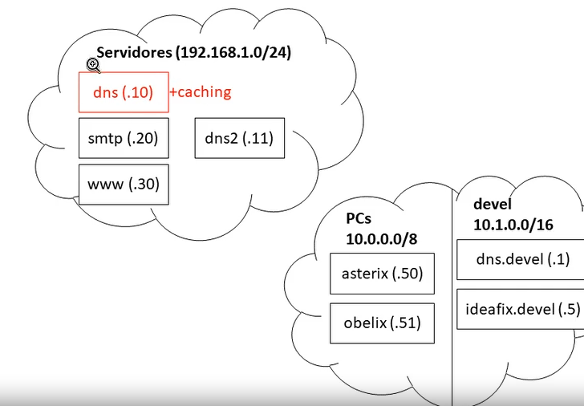
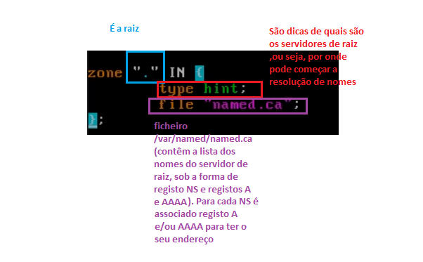

# MUITO IMPORTANTE

```Sempre que alteramos um ficheiro de zona``` devemos ```incrementar o numero de serie```


# Apontamentos  de configuração de servidores DNS - Parte 1: Caching NameServer

**Contexto**:

> Vamos configurar o ```Servidor DNS Master``` para servir como ```caching name server``` (ou seja, **servidor de nomes local**) ao qual as maquina que estão dentro da rede ```192.168.1.0/24``` podem pedir a resolução de ```qualquer nome``` (mesmo que não seja ```zonas``` para o este ```Servidor DNS``` não é ```master```)

> Um ```caching name server``` tem de aceitar ```pedidos recursivos``` (no named.conf tem que ter a linha **recursion yes;**) .

> A **ideia** de um ```caching name server``` é aceitar ```pedidos recursivos``` das máquinas da **rede local** e depois resolve de forma ```iterativa``` qualquer ```nome```.No fim, guarda a ```resposta final``` e ```respostas intermedias``` em ```cache``` e **devolve a resposta final** a quem **fez o pedido**





## Configurações para adicionar funcionalidade de caching name server

```Configurações feitas no dns.gauleses.test```

1. Adcionar as seguintes configurações no ```named.conf```

    + nano /etc/named.conf

> ```remover``` a linha seguinte (tem de aceitar pedidos recursivos ):


> ```Adicionar``` a linha seguinte (permitir pedidos recursivos, às maquinas da **rede local**)


> ```Indicar``` qual é o ```servidor de raiz```




2. Verificar configuração de ```named.conf```

    + named-checkconf

3. Fazer reload da configuração com ```rndc reload```


## Testes 

>```Nota```: com esta configuração de ```caching name server``` devemos ser capazes de ```resolver qualquer nome```

+ host google.com


+ host www.up.pt


## NOTAS IMPORTANTES


+ Mesmo que configuremos o ```Servidor DNS Master``` como ```caching name server``` não quer dizer que o ```Servidor DNS slave``` também funciona como ```caching name server``` (para tal ser possivel teriamos de configurar-lo para funcionar como ```caching name server```)