# MUITO IMPORTANTE

```Sempre que alteramos um ficheiro de zona``` devemos ```incrementar o numero de serie```

# Apontamentos  de configuração de servidores DNS - Parte 3: Delegação de Subdominios


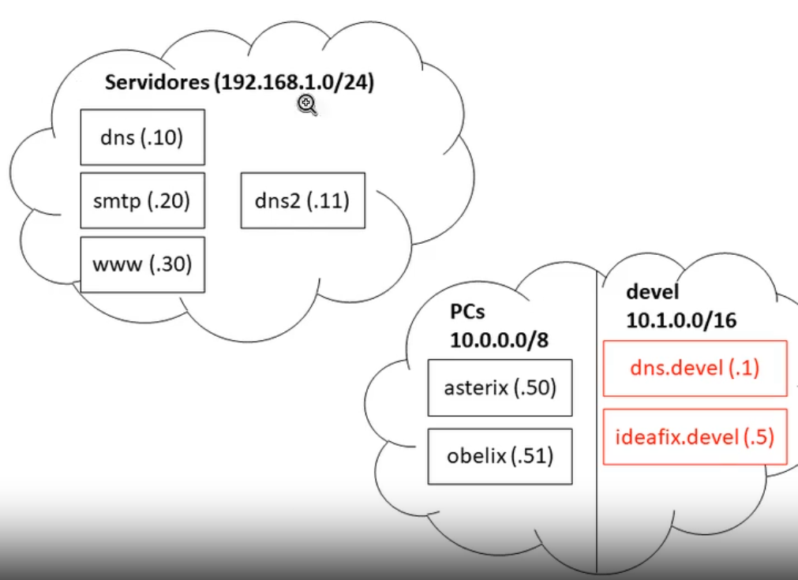


**Contexto**:

> Temos um departamento que precissa de liberdade na criação de nomes DNS e para não estar a incomodar o administrador DNS, faz-se a ```delagação``` de um ```subdominio```(```devel.gauleses.test```)

> O ```servidor DNS``` com **autoridade** sobre esse ```subdominio``` vai ser  ```dns.devel```

> Para poder ter ```autonomia``` na ```resolução inversa``` é delegado endereço **10.1.0.0/16** (sub-rede de **10.0.0./8**)


## Configurações no Servidor DNS Master (delegação)


1. Configurar ficheiro de ```zona``` de  ```resolução direta```

    + cd /var/named/master

    + nano gauleses.test.zone

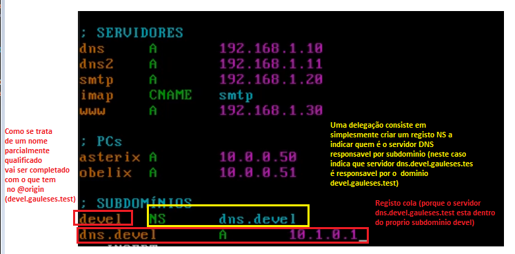


2. verificar configurações

    + named-checkzone  gauleses.test gauleses.test.zone

>O **warning** que aparece abaixo indica que ```dns.devel.gauleses.test``` esta ```fora de zona``` (mas nós sabemos que ele está ```dentro``` da ```esfera autoridade```)

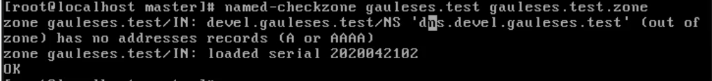


3. Configurar ficheiro de ```zona``` de  ```resolução inversa``` (**10.1.0.0/16**)

    + cd /var/named/reverse

    + nano 10.zone

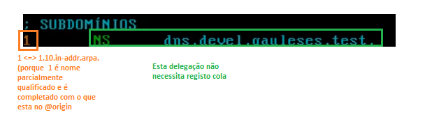

4. verificar configurações

    + named-checkzone 10.in-addr.arpa


5. fazer reload ao rdnc

    + rdnc reload


## Configuração do servido DNS que foi feita a delagação (dns.devel.gauleses.test)


1. Copiar as configurações do ```Servidor DNS Master```

    + ```No servidor DNS Master```

    + cd /etc 

    + scp named.conf ar@10.1.0.1: 

    + scp rndc.conf ar@10.1.0.1:

    + scp  /var/named/master/gauleses.test.zone ar@10.1.0.1:

    + scp  /var/named/reverse/10.zone ar@10.1.0.1:


    + ```No servidor dns.devel.gauleses.test```

    + cd /etc

    + cp ~ar/named.conf . 

    + cp ~ar/rndc.conf . 

        + chmod 640 rnd.conf

    + rndc-confgen -a -b 384

    + chrgp named rndc.key

    + chmod 640 rndc.key

2. Editar ```named.conf```

    + nano named.conf 

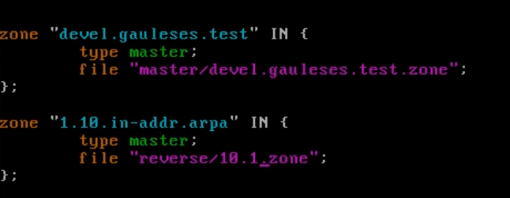

> remover allow-transfer

3. verificar ```named.conf```

    + named-checkconf

4. Criar diretorios de zonas

    + cd /var/named

    + mkdir master

    + mkdir reverse 

    + chgrp named master reverse

    + chmod 750 master reverse

5. Configurar zona ````master``` (usar copia que fizemos do servidor DNS master)

    + cp ~ar/gauleses.test.zone ./devel.gauleses.test.zone

    + nano devel.gauleses.test.zone (falta um ponto no endereço email do administrador)


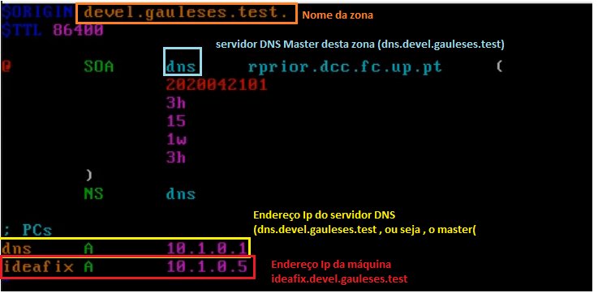

    + chgrp named devel.gauleses.test.zone


6. Verificar configuração

    + named-checkzone devel.gauleses.test devel.gauleses.test.zone


7. configurar zona ```reverse```

    + cd reverse

    + cp ~ar/10.zone ./10.1.zone

    + chgrp named  10.1.zone

    + nano 10.1.zone

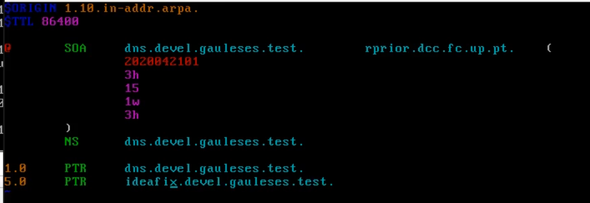


8. Verificar configuração  

    + named-checkzone 1.10.in-addr.arpa 10.1.zone


## Testar com host 

1. arrancar serviço ```named``` 

    + systemctl enable --now named 


2. host dns 

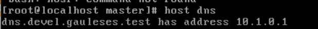

3. host ideafix

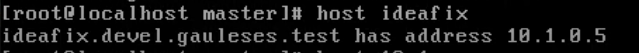


## Testar com dig 

```Na maquina dns.gauleses.test```

+ dig ideafix.devel.gauleses.test

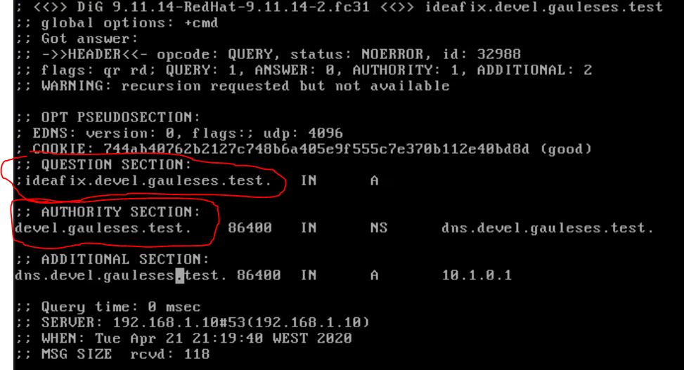

+ dig 1.0.1.10.in-addr.arpa PTR (resolucao inversa)

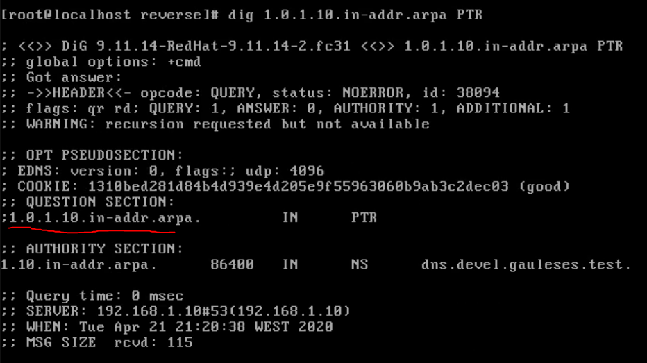