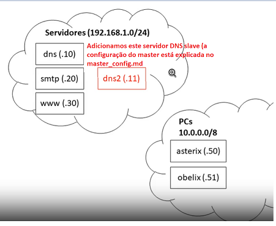
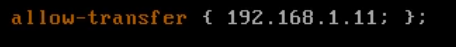
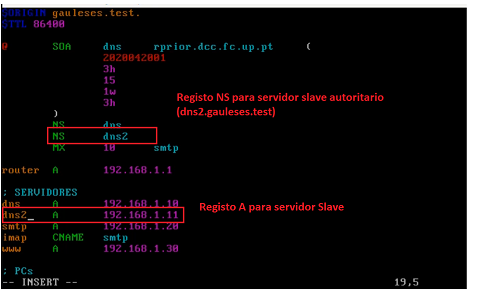
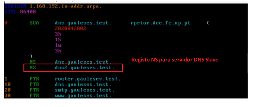
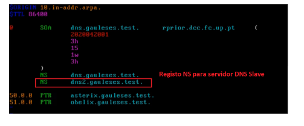
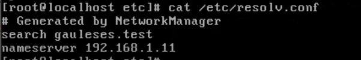
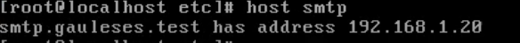
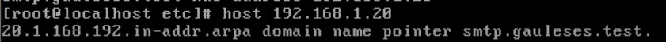
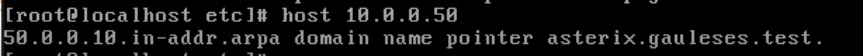

# MUITO IMPORTANTE

```Sempre que alteramos um ficheiro de zona``` devemos ```incrementar o numero de série```

# Apontamentos  de configuração de servidores DNS - Parte 2: slave

> Nas configurações de zonas acho que falta um ponto no email do administrador




> ```Nota Importante```

+ ```Servidor DNS master``` tem as zonas configuradas **localmente**

+ ```Servidor DNS slave``` vai buscar as zonas ao  **master** por ```transferencia de zona``` (também é autoritario sobre essas zonas, apenas não as tem localmente)


## Configuração Servidor DNS Slave

1. copiar as ```configurações inicias``` do ```master``` (**named.conf**, rndc.conf )

    + master $ scp /etc/named.conf ar@192.168.1.11

    + master $ scp /etc/rndc.conf ar@192.168.1.11

    + slave $ cd /etc/

    + slave $ cp ~ar/named.conf .

    + slave $ cp ~ar/rndc.conf . 

    + slave $ chmod o-r rndc.conf

2. Criação de ficheiro de chave rndc (configuração de chave secreta entre rndc e named) 

    +  rndc-confgen -a -b 384 -k rndc-key

    + chgrp named /etc/rndc-key

    + chmod 640 rndc.key 


### Configuração /etc/named.conf

> **Nota**: a configuração é praticamente identica a do master só temos de alterar o ```type``` nas **zonas** para ```slave``` em vez de ```master``` e indicar o ip do(s) servidor(es) ```master``` 


1. criar diretorio ```slaves``` (para guardar os ```ficheiros temporarios``` de zonas que vão ser pedidos ao ```master```)


2. verificar configurações do ```named.conf```

    + named-checkconf


## Alterações no MASTER para poder ter slave

```Configurações feitas no servidor DNS master```


1. **Permitir** a ```transferencia de zonas``` do ```Master``` para o ```Slave``` (podemos fazer por **zona** ou **global**). Neste caso fizemos **global** (se quisermos fazer por **zona**, basta por essa linha na respetiva **zona**)





2. verificar configurações do ```named.conf```

    +  named-checkconf

3. Acrescentar nos ```ficheiros de zona``` um registo ```NS``` para o ```servidor autoritario``` (tal como o ```Master``` o ```Slave``` também tem autoridade). Também é precisso acrescentar um registo ```A``` para ter saber o ```IP``` do servidor DNS ```slave``` (apenas necessarios na ```zona de resolução direta```)

    + nano /master/gauleses.test.zone




+ nano /reverse/192.168.1.zone




+ nano /reverse/10.zone



4. Fazer reload ao servidor dns master

    + rndc reload


## Ativação do serviço named no slave 

```Configurações feitas no servidor DNS slave```

1. systemctl enable --now named


## Verificações as configurações do slave


1. cat /etc/resolv.conf (esta configurado para usar a si proprio para resolver nomes)




2. host smtp (teste para verificar se faz ```resolução direta```)



3. host 192.168.1.20  (teste para verificar se faz ```resolução inversa```)



4. host 10.0.0.50 (teste para verificar se faz ```resolução inversa```)

