# Notas importantes

+ Cada ```zona``` deve conter **pelo menos**:
    
    + ```Registo SOA```

    + ```Registo NS``` a indicar o(s) servidor(es) **autoritarios por essa zona**

# Trabalho 4 - DNS

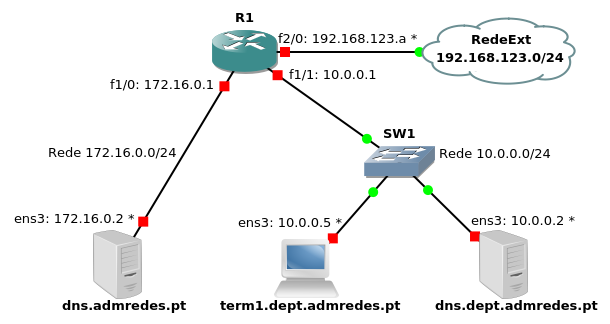


**Nota prévias:**
+ O comando ```rndc``` usa-se para **controlar** (**local** ou **remotamente**) o ```servidor de nomes``` (**named**), e.g., para carregar uma **configuração actualizada** (```rndc reload```) ou para **limpar a cache** (```rndc flush```). 

+ Por uma questão de segurança, é aconselhável mudar a chave default para comunicação entre o rndc e o named. Pode gerar uma nova chave usando o seguinte comando:

    ```bash
    rndc-confgen -a -b 384 -k rndc-key
    ```
    Este comando cria (ou modifica) o ficheiro /etc/rndc.key, com a definição de uma chave com o seguinte aspecto:

    ```bash
    key "rndc-key" {
            algorithm hmac-md5;
            secret "TqeiABSAEUqqREJhDDkHrcMK9o7mnNihXEbMAW/dBSU=";
    };
    ```
    Se o ficheiro /etc/rndc.conf existir, certifique-se de que não contém a definição dessa chave (se contiver, apague-a) mas inclui o /etc/rndc.key. Exemplo de configuração:

    ```bash
    include "/etc/rndc.key";
    options {
        default-server   localhost;
        default-key      rndc-key;
    };
    ```

    Faça o mesmo em relação ao ficheiro /etc/named.conf, certificando-se ainda de que a secção controls está configurada para usar a chave definida, e.g.:

    ```bash
    include "/etc/rndc.key";
    controls {
        inet 127.0.0.1 port 953
        allow { 127.0.0.1; } keys { rndc-key; };
    };
    ```

    Altere o grupo e as permissões do ficheiro com a chave usando

    ```bash
    chgrp named rndc.key
    chmod 640 rndc.key
    ```


+ Para **verificar** se o ```named.conf``` e os ```ficheiros de zona``` estão correctos pode **utilizar**, respectivamente, ```named-checkconf``` e ```named-checkzone zone file```, onde **file** é o **pathname** do ```ficheiro de zona```. **Faça sempre estes testes antes de pôr o serviço a correr**.

+ Sempre que **alterar as configurações** e fizer **rndc reload** para as activar, verifique nos logs que não ocorreram erros. 

+ Para **resolver nomes**, usam-se os comandos ```host``` ou ```dig```. Normalmente, o servidor a consultar é o indicado no ficheiro /etc/resolv.conf, que é actualizado ao obter endereços por DHCP. Se quisermos usar outro servidor (e.g., 172.16.0.2), podemos especificá-lo na linha de comando:

    ```bash
    host www.dcc.fc.up.pt 172.16.0.2
    dig @172.16.0.2 www.dcc.fc.up.pt
    ```


+ host www.dcc.fc.up.pt 172.16.0.2

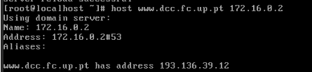

dig @172.16.0.2 www.dcc.fc.up.pt

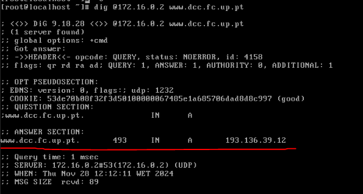

+ Por **questões de segurança**, o bind (**processo named**) não corre como root, mas sim como ```named```. Para que possa **ler os ficheiros de zona**, certifique-se de que estes pertencem ao ```grupo named``` e são ```legíveis pelo grupo```. 


 

## Configurações prévias

### Em cada um dos servidores DNS (dns.admredes.pt e dns.dept.admredes.pt) execute os seguintes comandos:

> **Notas** Antes de fazer estes passo, importar as configurações iniciais do router R1.

```bash
rndc-confgen -a -b 384 -k rndc-key
```
Este comando cria (ou modifica) o ficheiro /etc/rndc.key, com a definição de uma chave com o seguinte aspecto:

```bash

key "rndc-key" {
        algorithm hmac-md5;
        secret "TqeiABSAEUqqREJhDDkHrcMK9o7mnNihXEbMAW/dBSU=";
};
```
Se o ficheiro /etc/rndc.conf existir, certifique-se de que não contém a definição dessa chave (se contiver, apague-a) mas inclui o /etc/rndc.key. Exemplo de configuração:
```bash
include "/etc/rndc.key";
options {
    default-server   localhost;
    default-key      rndc-key;
};
```
Faça o mesmo em relação ao ficheiro /etc/named.conf, certificando-se ainda de que a secção controls está configurada para usar a chave definida, e.g.:

> **Notas** Remover as duas primeiras linhas do options


O servidor DNS ficava a escutar apenas no host

Remover a linha:


Permite apenas pedidos vindos do localhost

E por fim remover tambem a seguinte linha:


De seguida fazer restart da configuraçao com o seguinte comando:
**systemctl reload named**


```bash
include "/etc/rndc.key";
controls {
    inet 127.0.0.1 port 953
    allow { 127.0.0.1; } keys { rndc-key; };
};
```

Por fim  alterar o grupo e as permissões do ficheiro com a chave usando
    
```bash
    chgrp named /etc/rndc.key
    chmod 640 /etc/rndc.key
```

Depois de fazer estes passos correr este comando para verificar se o ficheiro tem erros.
    
```bash
    named-checkconf
```


###  De seguida iniciar o serviço named

```bash
systemctl start named
```


## Continuar com o que esta para baixo da figura (Objetivos)


### Configuração Servidor DNS Master (dns.admredes.pt)


```Configuração feita no dns.admredes.pt```

> **Dica util**: A cada alteração fazer verificação com ```named-checkconf```


1. Adição de configuração para ser ```caching name server``` (permitindo recursão apenas para a gama de endereços IP da respectiva ```rede local```)

    +   vim ```/etc/named.conf```

    > 

    + definir ```servidor raiz```

    >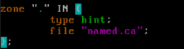

> Verificar configuração com **named-checkconf**

1. Criação das zonas em ```/etc/named.conf```

    + vim ```/etc/named.conf```

    + ```Zona resolução direta```

    >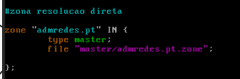

    + ```Zonas resolução inversa``` (**NÃO DEVIA TER RESOLUÇÃO INVERSA PARA 10.0.0.0/24** , essa resolução deve ser feita por **dns.dept.admredes.pt**)

    >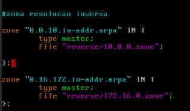

2. Criar diretorios para conter os ```ficheiros de zona```
    
    + cd /var/named


    + mkdir  master

    + mkdir reverse

3. Tornar diretorios com ```ficheiros de zona``` **acessiveis** por o ```named```

    + cd /var/named 

    + chgrp named master

    + chmod 750 master

    + chgrp named reverse

    + chmod 750 reverse

4. Criar e preencher para ```Zona de resolução direta``` (no caso e ```admredes.pt```)
    
    + cd /var/named/master/

    + touch admredes.pt.zone

        + chgrp named admredes.pt.zone

        + chmod 640 admredes.pt.zone

    + vim admredes.pt.zone


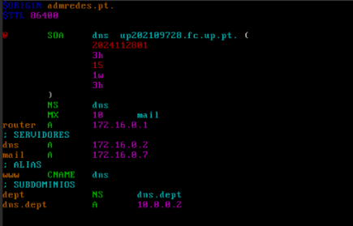

5. Verificar configurações  da ```Zona de resolução direta```

    + cd /var/named/master

    + named-checkzone admredes.pt admredes.pt.zone 

>O **warning** que aparece abaixo indica que ```dns.dept.admredes.pt``` esta ```fora de zona``` (mas nós sabemos que ele está ```dentro``` da ```esfera autoridade```)

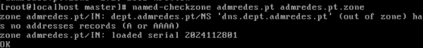


6. Criar e preencher ficheiros para ```Zonas de resolução inversa``` (no caso **172.16.0.zone** e **10.0.0.zone**)


    + cd /var/named/reverse/

    + touch 172.16.0.zone

        + chgrp named 172.16.0.zone

        + chmod 640 172.16.0.zone

    + touch 10.0.0.zone

        + chgrp named 10.0.0.zone

        + chmod 640  10.0.0.zone

    + vim 172.16.0.zone


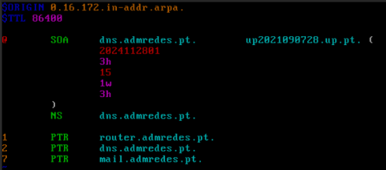

+ vim 10.0.0.zone

> (esta configuração so é precisso fazer no **dns.dept.admredes.pt**)

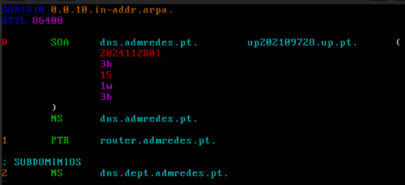

7. Verificar configurações  da ```Zona de resolução inversa```

    + cd /var/named/reverse/

    + named-checkzone 0.0.10.in-addr.arpa 10.0.0.zone

    >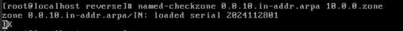

    + named-checkzone 0.16.172.in-addr.arpa 172.16.0.zone

    >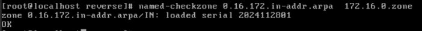

8. Fazer ```reload``` do ```rndc```

    +  rndc reload 

9. Arrancar serviço ```named```

    + systemctl enable --now named


### Configuração Servidor DNS com subdominio delegado (dns.dept.admredes.pt)


1. Copiar as configurações do ```Servidor DNS Master```

    + No servidor DNS Master

    + cd /etc

    + scp named.conf ar@10.0.0.2:

    + scp rndc.conf ar@10.0.0.2:

    + scp /var/named/master/admredes.pt.zone ar@10.0.0.2:

    + scp /var/named/reverse/10.0.0.zone ar@10.0.0.2:

    + No servidor ```dns.dept.admredes.pt```

    + cd /etc

    + cp ~ar/named.conf .

    + cp ~ar/rndc.conf .

    + chmod 640 rnd.conf

    + rndc-confgen -a -b 384

    + chrgp named rndc.key

    + chmod 640 rndc.key

> **TODO : CONFIRMAR CONFIGURAÇÃO FEITA NO PONTO 2**
2. Editar ```named.conf```

    + cd /etc/

    + vim named.conf

    > **Modificar para que permite recursão apartir da rede local**
    
    >

    > **Modificar zona resolucao direta**
    
    > 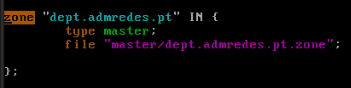

    > **Manter zona resolução inversa**
    
    > 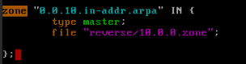

3. Verificar ```named.conf```

    +   named-checkconf

4. Criar diretorios de zonas 

    + cd /var/named

    + mkdir master

    + mkdir reverse

    + chgrp named master reverse

    + chmod 750 master reverse

5. Configurar ```zona master``` (usar copia que fizemos do servidor DNS master).**Não esquecer de por permissões corretas** para ```named``` ter acesso a ```ficheiro de zona```

    + cd  /var/named/master

    + vim dept.admredes.pt.zone


    > **TODO: confirmar configuração**: no registo MX devia ser (```dept.admredes.pt. MX 10 mail.admredes.pt.```) e não devia ter **registo A** para o mail, porque o ```nome esta fora desta zona```

    >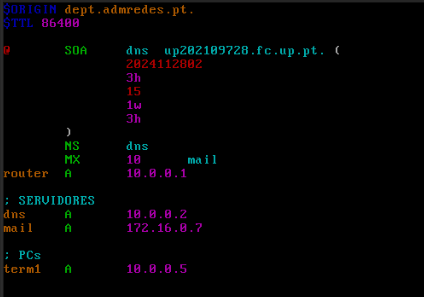 
    + chgrp named dept.admredes.pt.zone

    + chmod 640 dept.admredes.pt.zone

6. Verificar configuração

    + named-checkzone dept.admredes.pt dept.admredes.pt.zone
    
    > 


7. configurar ```zona reverse```. **Não esquecer de por permissões corretas** para ```named``` ter acesso a ```ficheiro de zona```

    + cd /var/named/reverse

    + cp ~ar/10.0.0.zone . 

    + chgrp named 10.0.0.zone

    + vim 10.0.0.zone

    > **TODO: confirmar configuração** (falta registo **2 PTR dns.dept.admredes.pt**)

    >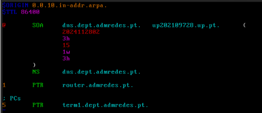

    + chgrp named  10.0.0.zone

    + chmod 640  10.0.0.zone

8. Verificar configuração

    + named-checkzone 0.0.10.in-addr.arpa 10.0.0.zone

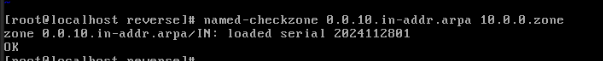


## Testes 


+ fazer ```rndc reload``` em ambos servidores DNS

+ arrancar serviço ```named``` em ambos servidores DNS

    + systemctl enable --now named


###  Testes feitos em ```dns.dept.admredes.pt```


+  host dns 

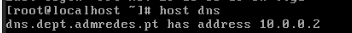


+ host router


+ host term1
    


+ host mail

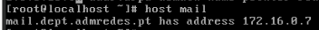

+ host 10.0.0.1

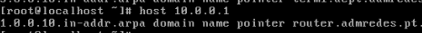
+ host 10.0.0.5

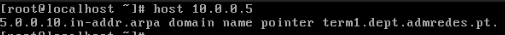


### Testes feitos em ```dns.admredes.pt```


+ host dns

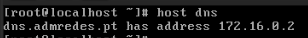

+ host router 

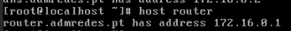

+ host mail


+ host 172.16.0.1

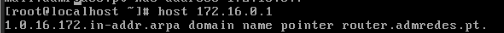

+ host 172.16.0.2

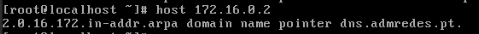

+ dig term1.dept.admredes.pt

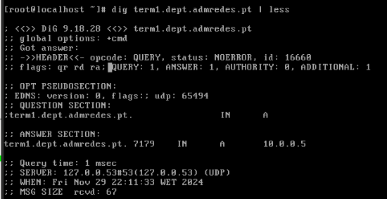

+ dig 5.0.0.10.in-addr.arpa PTR

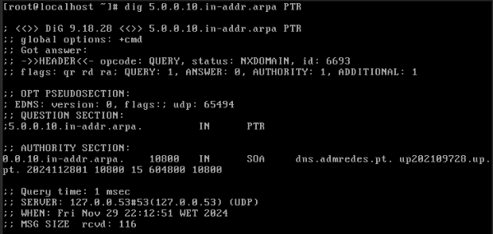