# Trabalho 4 - DNS 

>```NOTA IMPORTANTE```: ao visualizar capturas reparar que envolvam ver **perguntas** e **respostas** DNS podemos observar o ```0x....``` que associa ```pergunta``` a ```resposta```

## 1- No dns.admredes.pt, descubra o servidor de email do domínio dept.admredes.pt usando host -t mx dept.admredes.pt. (outRes)

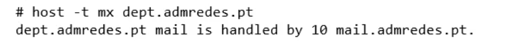

## 2- No dns.dept.admredes.pt, limpe a cache de DNS (rndc flush) e inicie uma captura wireshark. Em term1, tente descobrir o servidor de email do domínio admredes.pt. Explique o que se passou. (capRes + texRes) 

```Term1```

+ host -t mx admredes.pt

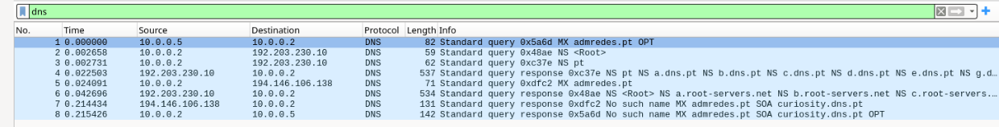


R: O ```Term1``` tenta resolver endereço de ```dns.admredes.pt```(como ```dns.dept.admredes.pt``` é um **servidor caching** , e não tem autoridade sobre admredes.pt, ele vai aceitar pedidos recursivos e vai resolver-los iterativamente).

Logo segue os passos: 

1. Fala com servidor raiz para descobrir servidores com **autoridade** sobre **dominio** ```.pt```

2. Depois o contacta um desser servidores com ```autoridade sobre .pt``` para saber se conhecem algum servidor com **autoridade** sobre **dominio** ```admredes.pt``` (como não conhecem nenhum servidor que tenha autoridade sobre esse dominio, aparece erro ```Host admredes.pt not found: 3(NXDOMAIN)```).

3. Importante  reparar que **admredes.pt** é um **dominio privado** (e **não esta registado em nenhum** servidor com autoridade sobre o dominio ```.pt```)

>**NOTA**: no caso em que fizemos **host -t mx dept.admredes.pt.** apartir de ```dns.dept.admredes.pt``` e funciona porque ```dns.dept.admredes.pt.``` esta debaixo de ```dns.admredes.pt```

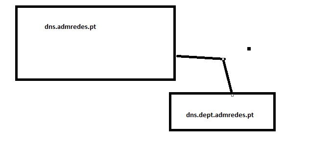

## 3- No dns.dept.admredes.pt, limpe cache de DNS (rndc flush) e inicie uma captura wireshark. Em term1 use o comando dig para resolver o nome www.jn.pt. 


+ ```term 1```

    + dig www.jn.pt.

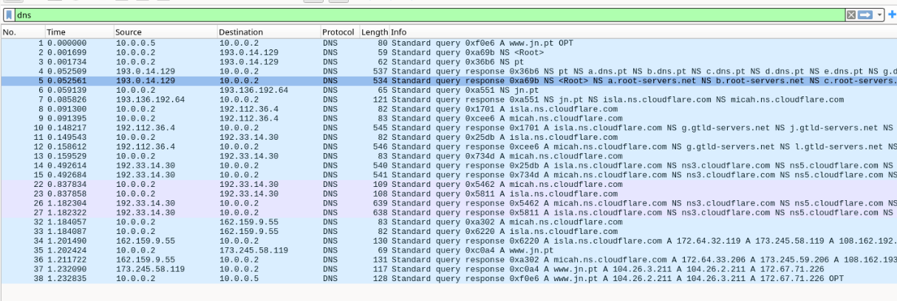


### a.Recorrendo à captura feita, diga qual foi o caminho seguido pelo(s) pedido(s) do registo A e respectiva(s) resposta(s). Na img/imagem da captura deverá mostrar apenas os pacotes relevantes. (capRes + texRes)


> **Nota**: usei filtro ```dns```

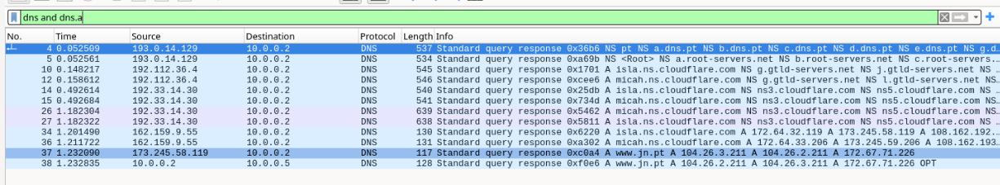


R: Os passos seguidos são os seguintes:

+ ```pedido recursivo``` de **term1** para servidor nomes caching **dns.dept.admredes.pt**

> 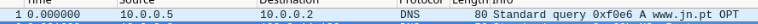


+ ```dns.dept.admredes.pt``` pede a lista de servidores **raiz** (atualizar a sua lista local de servidores raiz, tem esta lista porque é caching name server)

    + **pedido**
    
    >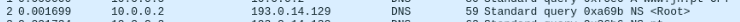

    + **resposta**

    >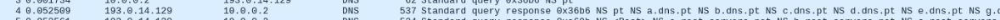


+ ```dns.dept.admredes.pt``` pergunta ao ```servidor raiz``` por os **servidores** com autoridade sobre o **dominio** ```.pt```

    + **pedido**

    >

    + **resposta**

    >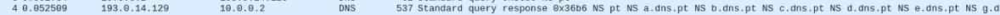

+ ```dns.dept.admredes.pt``` pergunta ao ```servidor com dominio sobre .pt``` por **servidores** com autoridade sobre o **dominio** ```jn.pt``` 

    + **pedido**

    > 

    + **resposta**

    > 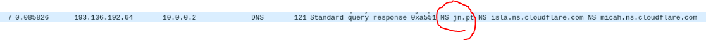

+ (**ignorando a parte do cloudflare**) ```dns.dept.admredes.pt``` pergunta ao ```servidor com dominio sobre jn.pt``` por o **endereço** (**registo A**) do servidor com ```www.jn.pt```

    + **pedido**

    > 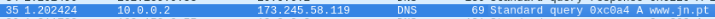

    + **resposta**

    >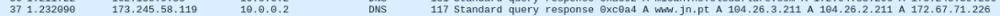

+ ```dns.dept.admredes.pt``` devolva a resposta da **resolução iterativa** para ```term1``` com o respetivo endereço de ```www.jn.pt```


### b. Indique se a resposta dada ao terminal é autoritária, identificando os campos da mensagem que o levam a essa conclusão. (capRes + texRes) 

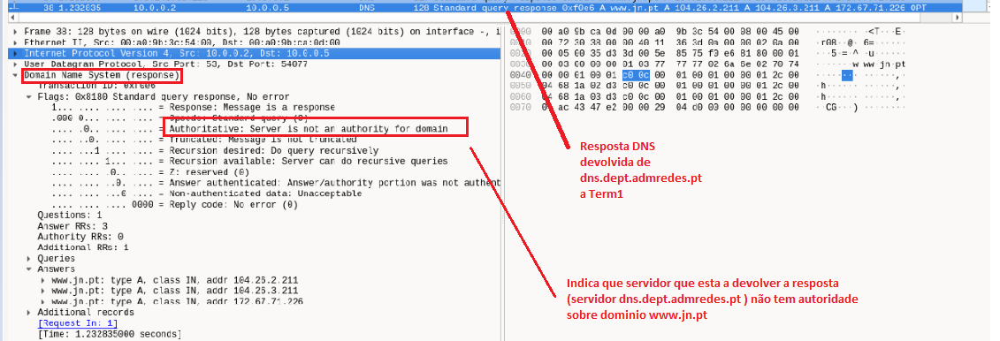

R: Não porque a reposta dada pelo ```caching name server``` não tem autoridade sobre esse dominio (de forma geral todas as respostas dadas por o ```caching name server```, mostram que esse servidor não tem autoridade).Se verificarmos a secção ```Authority section```  da **resposta DNS** vemos que tem o ```servidor não é autoritario sore o dominio```

>Nota: Em **todas as respostas** dadas no processo de ```resolução iterativa```, os respetivos **servidores que responderem** tem implicitamente ```autoridade sobre o dominio``` que é **perguntado** 


### c. Diga se a resposta obtida pelo dns.dept.admredes.pt é autoritária e justifique. (texRes)

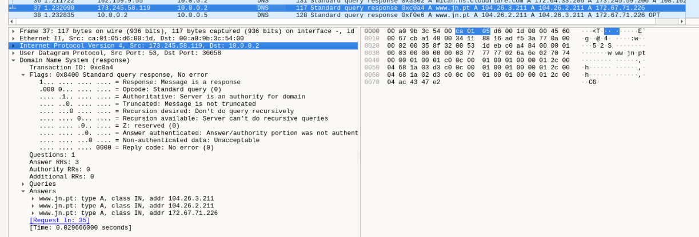

R: Sim , porque neste caso quem devolva a resposta é um servidor com autoridade sobre o dominio ```www.jn.pt``` (como se trata de um processo de ```resolução iterativa``` é implicito que as respostas que são devolvidas nesse processo vem de **servidores** que tem **autoridade** sobre o **dominio** que é perguntado)

### d. Note que existe mais do que um endereço para este nome e que a ordem dos endereços é round-robin. Que vantagens se podem obter destes factos? (texRes)

R: A vantagem que podemos obter com o uso de **round-robin** na ordem endereços obtidos na resolução iterativa permitem fazer ```distribuição de carga``` entre as varias replicas da maquina ```www.jn.pt```

## 4- Diga o que entende por glue record e qual a sua utilidade. Foi necessário usar um nesta montagem? Em caso afirmativo, em que máquina? (texRes) 


R: O ``registo cola`` permite resolver a **dependencia ciclica** que ocorre quando delegamos ```subdominios``` dentro de um dado ```dominio``` com **mesmo nome** (basicamente consiste num ```registo A``` que é associado ```delegação de subdominio feita```).Foi necessário utilizar nesta montagem no ```dns.admredes.pt``` que delegou o **subdominio** ```dept.admredes.pt``` ao servidor ```dns.dept.admredes.pt```.


>**Exemplo (SEM REGISTO COLA)**

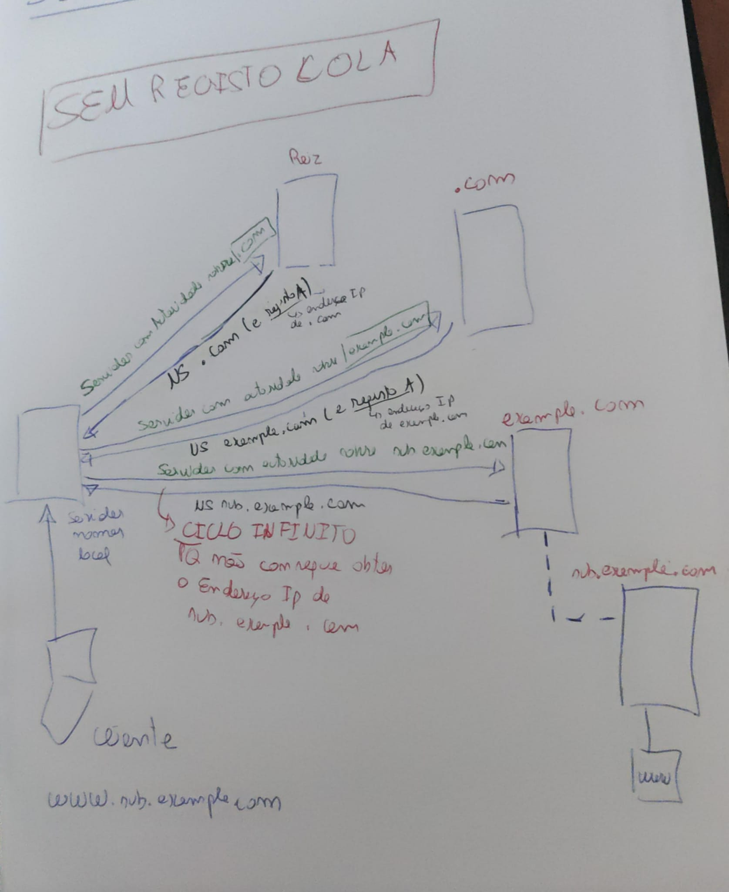

+ Temos ```dns.example.com``` que delega o subdominio ```sub.example.com``` ao servidor dns ```dns.sub.example.com```.

+ Supondo que queremos resolver ```www.sub.example.com```

    1. Para tal temos de consultar servidor autoritario ```dns.sub.example.com```

    2. Mas para isso é precisso resolver ```dns.sub.example.com```

    3. O que implica consultar ```dns.sub.example.com```

    4. **Dependência cíclica!!**

>**Exemplo (COM REGISTO COLA)**
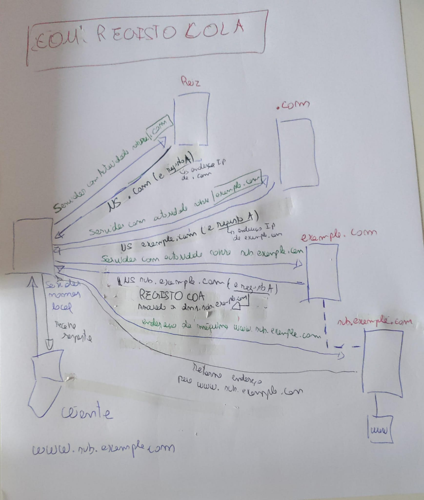


## 5- Quando é usado NAT, a resolução de endereços tem que ser diferente consoante o pedido veio de uma máquina interna ou externa. Isto faz-se usando vistas. 


> **Nota**: Nesta pergunta vamos alterar o NAT no router R1 para ```NAT puro ```(sem tradução de portas), de modo a que as máquinas da rede **172.16.0.0/24** sejam **vistas no exterior** como pertencendo à rede ```192.168.80.0/24```, mantendo a parte de host. Para tal, corra em R1 (modo de configuração) os seguintes comandos:
    
+ no ip nat inside source list 2 interface FastEthernet2/0 overload (**desativar NAT com tradução de portas**)
    
+ ip nat inside source static network 172.16.0.0 192.168.80.0 /24 no-alias no-payload (**Ativar NAT puro**)

### a. Configure vistas no dns.admredes.pt de modo a que, quando os pedidos são feitos de fora das redes 172.16.0.0/24 ou 10.0.0.0/24, os endereços da rede 172.16.0.0/24 sejam vistos como estando na rede 192.168.80.0/24. Indique as alterações que teve de fazer nos ficheiros de configuração. (confRes) 

>**duvida**: estava a dar erro quando faço named-check conf (**when using 'view' statements, all zones must be in views**). Mas todas as zonas estao dentro de view's

> Alterações no ```named.conf```

+ ```Vista "dentro"``` (**zona para 10.0.0.0 não devia estar aqui**)

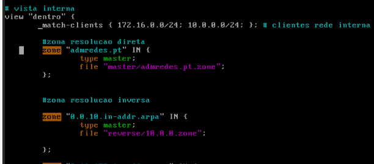

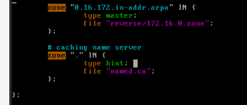

>**versão do professor**

> 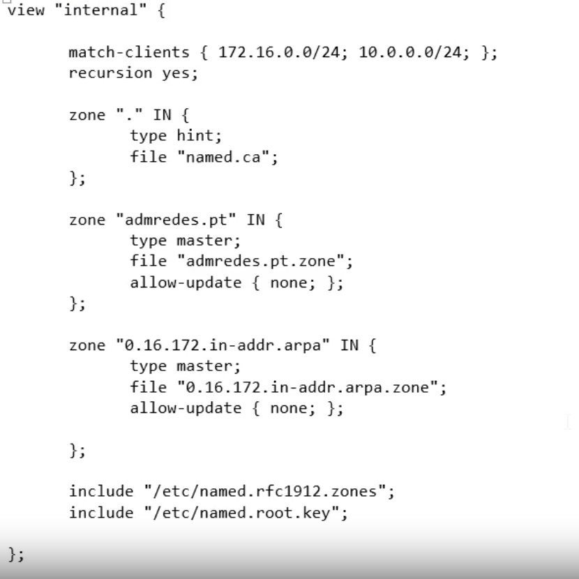

+ ```Vista "fora" ```

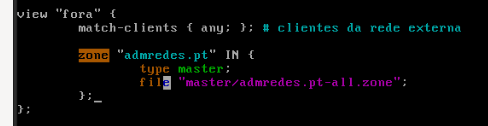

>**Versão do professor**

> 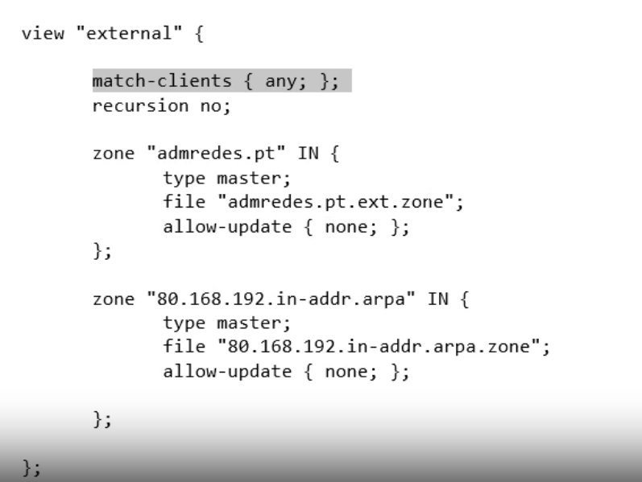


> Ficheiro ```admredes.pt-all.zone``` (clientes na ```rede externa```)

+ Criar ficheiro ```admredes.pt.ext.zone```

    + cd /var/named/master/

    + touch admredes.pt-all.zone

        + chgrp named admredes.pt.ext.zone

        + chmod 640 admredes.pt.ext.zone

+ Criar ficheiro ```192.168.80.zone```

    + (...)


> ```Ver configurações no video 2 , mais para o final(Discusao de resultados)```

### b. Teste a configuração da vista interna descobrindo o endereço IP de router.admredes.pt a partir do próprio dns.admredes.pt. (outRes) 


### c.Na própria máquina onde está a correr o GNS3, que também está ligada à rede 192.168.123.0/24, adicione uma rota para a rede 192.168.80.0/24 através do 192.168.123.a (o endereço IP obtido por DHCP pelo router Cisco na interface f2/0). Para testar a configuração da vista externa, obtenha o endereço IP de router.admredes.pt a partir dessa máquina usando o comando host router.admredes.pt. 192.168.80.2 (outRes) 

> **Nota**:  Após concluir esta questão, reponha a configuração original no router R1. Reponha também a configuração anterior a esta pergunta (sem vistas) no dns.admredes.pt.  (```desligar e ligar todas as maquinas```, isto basta porque não guardamos a configuração feita no router no ```running config```)


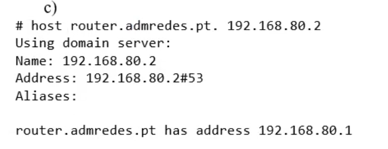

## 6- Sendo o DNS um serviço fundamental na rede, praticamente todas as redes implementam, além do master, um ou mais servidores slave para obter tolerância a falhas e/ou distribuição de carga. Faça as alterações necessárias aos ficheiros de configuração para que dns.admredes.pt funcione também como slave de dns.dept.admredes.pt para o subdomínio dept.admredes.pt. 


```dns.admredes.pt``` passa a ser slave de ```dns.dept.admredes.pt``` para o **subdominio** ```dept.admredes.pt```

### a. Indique as alterações que teve de fazer nos ficheiros de configuração. (confRes) 

+ Configurações feitas no ```dns.admredes.pt``` (```SLAVE```)

    + Adicionar ```zona``` do tipo slave (```dept.admredes.pt```)

    > 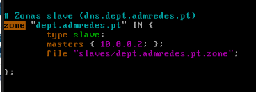

    + Alterar ficheiro de zona de admredes.pt (**admredes.pt.zone**)  para indicar ```dns.admredes.pt``` é um servidor autoritario sobre dominio ```dept.admredes.pt``` 

    > 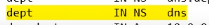

+ Configurações feitas no ```dns.dept.admredes.pt``` (```MASTER```)

    + permitir a ```transferencia de zona``` para ```dns.admredes.pt```

    > 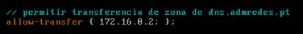

    + Configurar em ```cada zona``` o **registo NS** para indicar que **dns.admredes.pt** é ```autoritario``` sobre o dominio **dept.admredes.pt** (```dept.admredes.pt NS dns.admredes.pt```)


### b. Faça uma captura de pacotes em dns.dept.admredes.pt e active as novas configurações. Identifique na captura a transferência do domínio dept.admredes.pt do master para o slave. (capRes) Se já tinha activado as novas configurações antes de fazer a captura, provavelmente não será feita nova transferência de domínio. Se isto acontecer, vá ao dns.admredes.pt e faça rndc retransfer <zona> para cada uma das zonas slave. 

+ Fazer **rndc reload** em ambos os servidores DNS 


+ ```Pedido``` de **transferência de zona** feita pelo ```SLAVE``` para o ```MASTER```


+ ```Resposta``` do ```MASTER``` para o ```SLAVE``` com a respetiva **transferência de zona** (VIA ```TCP```)

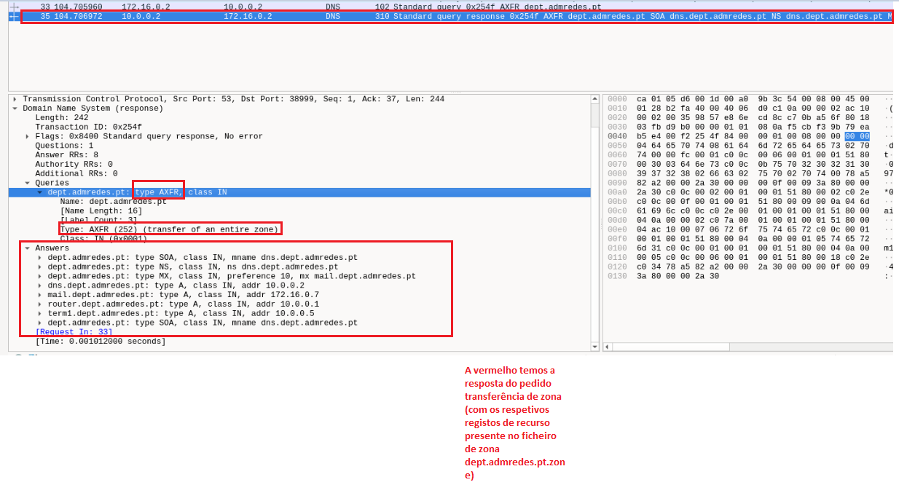


> Para confirmar os registos pedidos (pus uma screenshot do ficheiro dept.admredes.pt.zone)

>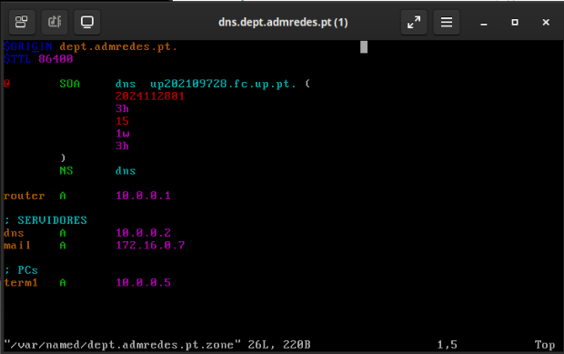


### c. Antes da transferência de domínio é feito um outro pedido para o registo SOA. Explique para que serve este registo e por que razão é pedido antes de fazer a transferência de domínio. (texRes) 


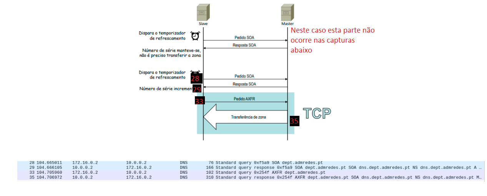

R: Fluxo típico de verificação SOA e transferência

1. O ```Slave``` envia uma **consulta SOA** ao ```Master```.

2. O ```Master``` responde com o **registo SOA atual**.

3. O ```Slave``` **compara o número de série com sua cópia local**:

    + Se o ```número for maior```: O ```Slave``` inicia uma **transferência** (AXFR ou IXFR).

    + Se o ```número for igual```: O ```Slave``` **não faz nada**, pois já possui os dados mais recentes.

    +  Após uma transferência bem-sucedida, o ```Slave``` atualiza sua zona e registra o novo número de série.


### d. Verifica alguma diferença entre o protocolo de transporte usado para a transferência de domínio e o normalmente usado para as outras perguntas DNS? Qual a razão para essa diferença? (texRes) 

R: O **protocolo** normalmente usado para as outras perguntas DNS é o ```UDP``` porque o estabelecimento de conexão TCP seria um desperdicio para os pedidos/respostas "normalmente" usados.

No entanto no caso em que fazemos ```Transferências de zona``` (entre master e slave) utilizamos **sempre** sobre ```TCP```, para ```garantir fiabilidade``` na informação transmitida (podendo ter grande volume de informação)

### e. No dns.admredes.pt, faça uma captura de pacotes na pseudo-interface any (use o comando tcpdump -i any -w askslave.pcap port 53 &). Teste a nova configuração descobrindo o servidor de email de dept.admredes.pt a partir de dns.admredes.pt. Pare a captura (killall -INT tcpdump). (capRes) 

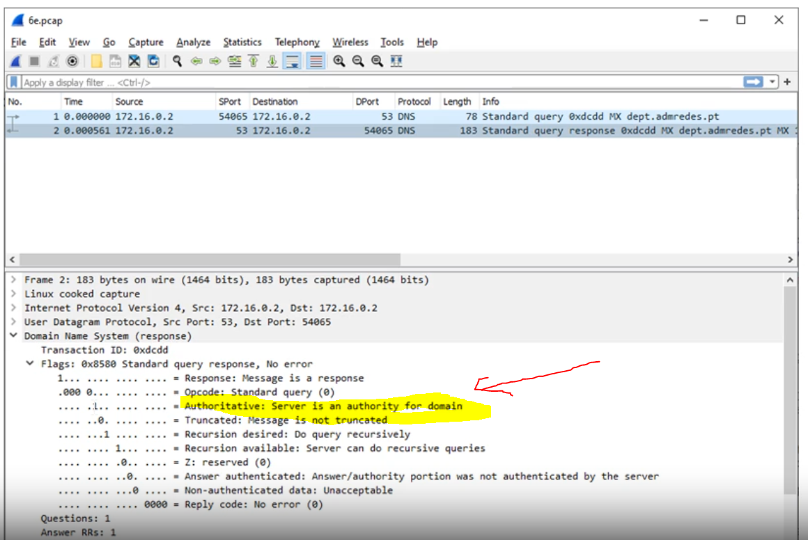

### f. Copie o ficheiro askslave.pcap para a VM onde está a correr o GNS3 e abra-o no Wireshark. Verifique se a resposta DNS que obteve na alínea anterior é autoritária e explique porquê. (texRes)


R: Sim, porque foi obtida de um servidor autoritario (**tanto servidores MASTER e SLAVE são autoritarios por as zonas**)

## 7- A configuração da zona ".", do tipo hint, necessita dum ficheiro (normalmente chamado named.ca). Observe o conteúdo desse ficheiro e explique a sua função. (texRes) 

R: A função do ficheiro ```named.ca``` consiste numa  ```lista de servidores de raiz``` e respectivos endereços IP (e IPv6) para que o **caching name server** possa fazer ```resolução iterativa``` de qualquer nome.

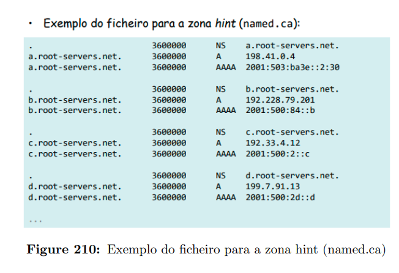