# Trabalho 1 - Encaminhamento estático

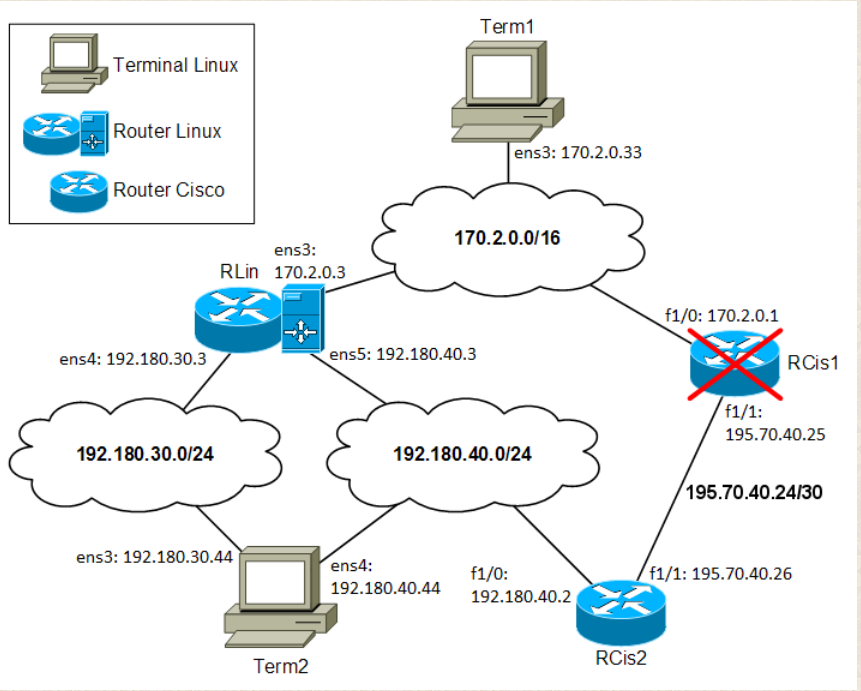

## Configurações iniciais
**NOTAS** :
+ login: **root** password:**admredes24**  
+ nmtui guarda automaticamente as configurações feitas em **keyfiles** 
para manter as mudanças de rede persistentes
+ Confirmar sempre as configurações feitas antes de avançar
+ Nos **router's linux** temos de colocar a linha **"net.ipv4.ip_forward=1"** no ficheiro **/etc/sysctl.conf** para permitir reencaminhamento de  pacotes
+ Nos **router's cisco** ao configurar qualquer **interface** não esquecer de fazer **no shutdown** para ativar-la
+ Nos **router's cisco** para ter as **configurações persistentes** temos de executar o comando **copy running-config startup-config**


### Term1 (interface e rota)
    Configurar Interface e rota
    1- nmtui
        1.1- editar a interface ens3
        1.2- Ipv4 configuration: Manual 
        1.3- Addresses: 170.2.0.33/16
        1.4- Gateway: 170.2.0.3 
        1.5- Routin (Edit) 
        1.6- Destination: 192.180.40.0/24 Next hop : 170.2.0.1 Metric ---
        //Se a rede destino tiver prefixo 192.180.40.0/24 então o
        //proximo salto é 170.2.0.1
        1.7- OK -> BACK
        1.8- Activate connection ens3
    Confirmar configuração interface
    2- ifconfig ens3 
    Confirmar configuração de rota
    3- route -n
        

### Term2 (interface e rota)
    1- nmtui
        1.1  - editar a interface ens3
        1.2  - Ipv4 configuration: Manual 
        1.3  - Addresses: 192.180.30.44/24
        1.4  - OK
        1.5  - editar a interface ens4
        1.6  - Ipv4 configuration: Manual
        1.7  - Addresses: 192.180.40.44/24
        1.8  - Gateway: 192.180.40.2
        1.9  - Desativar opção "Never use this network for default route"
        1.10 - Ativar o "Automatically connect"
        1.11 - OK -> BACK
        1.12 - Activate connection ens3 e ens4
    Confirmar configuração das interfaces
    2. ifconfig 
    Confirmar configuração de rota
    3. route -n


### RLin (Interfaces)
    Ativar reencaminhamento ne pacotes 
    1- nano /etc/sysctl.conf 
        1.1- adicionar seguinte linha "net.ipv4.ip_forward=1"
        1.2- sysctl -p (rele ficheiro de configuração)
    Configurar interfaces
    2- nmtui
        2.1  - editar a interface ens3
        2.2  - Ipv4 configuration: Manual 
        2.3  - Addresses: 170.2.0.3/16
        2.4  - OK
        2.5  - editar a interface ens4
        2.6  - Ipv4 configuration: Manual
        2.7  - Addresses: 192.180.30.3/24
        2.8  - Desativar opção "Never use this network for default route"
        2.9  - Ativar o "Automatically connect"
        2.10  - OK
        2.11  - editar a interface ens5
        2.13 - Ipv4 configuration: Manual
        2.14 - Addresses: 192.180.40.3/24
        2.15 - Desativar opção "Never use this network for default route"
        2.16 - Ativar o "Automatically connect"
        2.17 - OK -> BACK
    	2.18 - Activate connection ens3, ens4 e ens5
        Confirmar configuração das interfaces
        3. ifconfig 
        Confirmar configuração de rota
        3. route -n
        // Vemos as rotas diretamente ligadas (se o gateway for 0.0.0.0
        // isto implica que existe conexão direta)

### RCis1 (Interfaces e rotas)
    1  - enable
    2  - conf t
    3  - show ip int brief
    4  - int f1/0
    5  - ip addr 170.2.0.1 255.255.0.0
    6  - no shutdown
    7  - int f1/1
    // ip address <addr> <netmask>
    8  - ip addr 195.70.40.25 255.255.255.252
    9  - no shutdown
    10 - exit 
    //ip route <prefix> <netmask> <gateway>
    //RCis1 deve ter uma rota para 192.180.40.0/24 através de RCis2
    11 - ip route 192.180.40.0 255.255.255.0 195.70.40.26
    Confirmar configuração interfaces
    12 - show ip int brief
    Confirmar a rota
    13 - show ip route
    Guardar permanentemente as configurações
    14 - copy running-config startup-config

### RCis2 (Interfaces e rotas)
    1  - enable
    2  - conf t
    3  - show ip int brief
    4  - int f1/0
    5  - ip addr 192.180.40.2 255.255.255.0
    6  - no shutdown
    7  - int f1/1
    8  - ip addr 195.70.40.26 255.255.255.252
    // RCis2 deve ter uma rota para 170.2.0.0/16 através de RCis1
    9  - ip route 170.2.0.0 255.255.0.0 195.70.40.25
    10 - end
    11 - show ip route
    12 - copy running-config startup-config

### Verificar se existe comunicação 

    1- terminal Term1
        1.1 - ping 192.180.30.44 (Sucesso)
        1.2 - ping 192.180.40.44 (Sucesso)


**Notas**: 
+ As **interfaces de rede** das **máquinas Linux**, **ens3**, **ens4** e **ens5**, aparecem no **GNS3** como **Ethernet0**, **Ethernet1** e **Ethernet2**, respectivamente
+ Para que as **capturas de traceroute** sejam mais fáceis de interpretar, use a opção -N desse comando: **traceroute -n -N 1 <ipaddr>**

## Questões/Traces/Análise
+ **outRes** significa capturar o output de um comando
+ **capRes** significa uma captura de pacotes (Wireshark ou tcpdump)
+ **confRes** significa anotar o(s) comando(s) para fazer a configuração pedida
+ **texRes** significa uma resposta textual (explicação, interpretação de resultados, …).


### 1. Connectividade:
    
#### a. Faça traceroute do Term2 para cada uma das interfaces do RLin.(outRes)

**ens3**

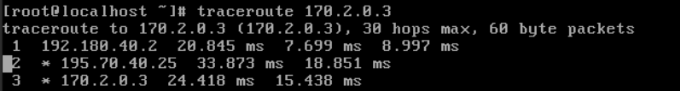
    
**ens4**

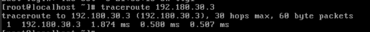
    
**ens5**

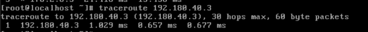


#### b. Faça traceroute do Term1 para cada uma das interfaces do Term2 nas seguintes condições:

**show ip route RCis 2** 

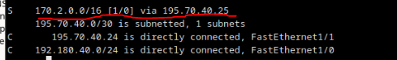

        
    i.   RCis2 sem rota para a rede 170.2.0.0/16 (outRes)
        - enable
        - conf t 
        - no ip route 170.2.0.0 255.255.0.0 195.70.40.25
        - show ip route 
        - copy running-config startup-config
**ens3**    

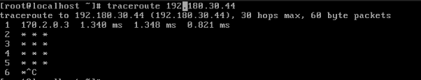

**ens4**

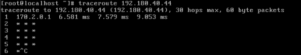
        
    ii.  RCis2 com rota para a rede 170.2.0.0/16 através de RCis1 (outRes); indique também o comando usado para criar a rota (confRes)
        - enable
        - conf t 
        - ip route 170.2.0.0 255.255.0.0 195.70.40.25
        - show ip route 
        - copy running-config startup-config

**ens3**

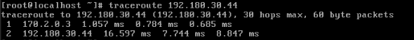

**ens4**

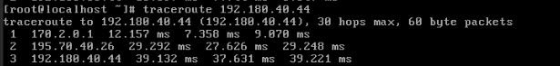

    iii. RCis2 com rota para a rede 170.2.0.0/16 através de RLin (outRes)
        - enable
        - conf t 
        - no ip route 170.2.0.0 255.255.0.0 195.70.40.25
        - ip route 170.2.0.0 255.255.0.0 192.180.40.3
        - show ip route 
        - copy running-config startup-config

**ens3**

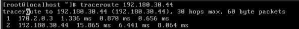

**ens4**

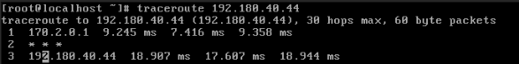

**Dúvida: porque que não aparece o router RLIN e aparece \* \* \* ?**
R: A certos routers, que "escondem" este tipo de pacote


#### c. Desligue agora o RCis1 para simular que avariou e repita a alínea anterior.
    
**clicar shutdown no RCis1**

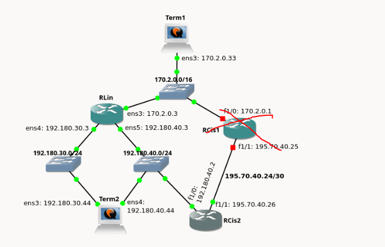

    i.   RCis2 sem rota para a rede 170.2.0.0/16 (outRes)
    (colocar como estava no ponto i da alinea b)
        - enable
        - conf t 
        - no ip route 170.2.0.0 255.255.0.0 192.180.40.3 (veio da alinea anterior)
        - no ip route 170.2.0.0 255.255.0.0 195.70.40.25 
        - show ip route 
        - copy running-config startup-config

**ens3**

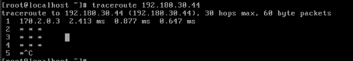

**ens4**
+ <u>(!H -> significa que o ip que aparece, no caso 170.2.0.33 foi recebido ICMP-Host Unreachable)</u>
+ <u>O ICMP Host Unreachable foi gerado por o ARP (que fez tres tentivas de descobrir o MAC de RCis1,e como não teve sucesso gerou esse erro e envio para o Term1)</u>

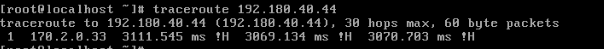

    ii.  RCis2 com rota para a rede 170.2.0.0/16 através de RCis1 (outRes); indique também o comando usado para criar a rota (confRes)
        - enable
        - conf t 
        - ip route 170.2.0.0 255.255.0.0 195.70.40.25
        - show ip route 
        - copy running-config startup-config

**ens3**

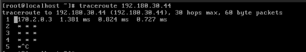

**ens4**
+ <u>(!H -> significa que o ip que aparece, no caso 170.2.0.33 foi recebido ICMP-Host Unreachable)</u>
+ <u>O ICMP Host Unreachable foi gerado por o ARP (que fez tres tentivas de descobrir o MAC de RCis1,e como não teve sucesso gerou esse erro e envio para o Term1)</u>

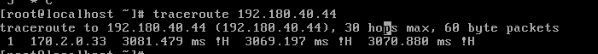

    iii. RCis2 com rota para a rede 170.2.0.0/16 através de RLin (outRes)
        - enable
        - conf t 
        - no ip route 170.2.0.0 255.255.0.0 195.70.40.25
        - ip route 170.2.0.0 255.255.0.0 192.180.40.3
        - show ip route 
        - copy running-config startup-config

**ens3**

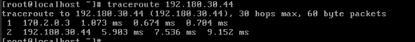

**ens4**

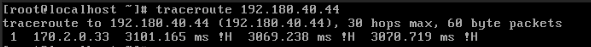

**NOTA: RCis1 deverá permanecer desligado para o resto do trabalho.**

#### d. Explique o que se passa em cada um dos casos na alínea anterior. (texRes)
        
    i.   RCis2 sem rota para a rede 170.2.0.0/16 

        ens3: Como não temos rota para a rede com prefixo 170.2.0.0/16 portanto o pacote vai seguir o caminho Term1->Rlin->Term2->RCis2 e fica "preso" porque RCis2 não tem rota para a red com prefixo 170.2.0.0/16

        ens4: O pacote não saio do Term1 visto que (apesar de existir uma rota no Term1 que indica que para a rede com prefixo 192.180.40.0/24 o proximo salto é RCis1) o RCis1 encontra-se desativado.
    
    ii.  RCis2 com rota para a rede 170.2.0.0/16 através de RCis1 

        ens3: igual a alinea anterior

        ens4: igual ao anterior

    iii. RCis2 com rota para a rede 170.2.0.0/16 através de RLin 

        ens3: Neste caso como temos uma rota para a rede com o prefixo 170.2.0.0/16 via Rlin, uma pacote segue o seguinte caminho Term1->Rlin->Term2->RCis2->Rlin->Term1

        ens4: Apesar de termos esta nova rota para 170.2.0.0/16 através de Rlin, o Term1 tem a rota definida para a rede com prefixo 192.180.40.0/24 através do RCis1, o que leva a o pacote ficar no Term1

#### e. Tendo em conta as duas alíneas anteriores, identifique condições genéricas que tornam vantajoso o uso de encaminhamento dinâmico numa rede. Justifique. (texRes)

**(Nossa resposta)Verificar resposta**

    As condições genéricas que tornam vantajoso o uso de encaminhamento dinâmico numa rede são o caso em que ocorrem mudanças na rede (encaminhamento dinamico ajusta-se automaticamente a estas mudanças).No caso das alineas anterios,se usarmos rotas estaticas e um router (RCis1 no caso) falhar, então todas as rotas que o utilizem vão falhar.

**Resposta professor**

    O encaminhamneto dinâmico pode estabelecer/alterar rotas, ou seja , adaptar rotas a caminhos funcionais. Para tal ser possivel, seria necessário rotas alternativas.


#### f. Faça um traceroute do Term2 para o Term1 nas três condições indicadas na alínea b. (outRes)

    i.   RCis2 sem rota para a rede 170.2.0.0/16 (outRes)
        - enable
        - conf t 
        - no ip route 170.2.0.0 255.255.0.0 192.180.40.3 (configurado na alinea anteriore)
        - show ip route 
        - copy running-config startup-config

**Nota: da host unreachable, mas neste caso é gerado por o RCis2 e não foi gerado por ARP mas sim pelo facto de RCis2 não conseguir chegar ao Term1 por não ter rota para lá**

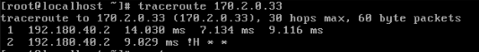

    ii.  RCis2 com rota para a rede 170.2.0.0/16 através de RCis1 (outRes); indique também o comando usado para criar a rota (confRes)

        - enable
        - conf t 
        - ip route 170.2.0.0 255.255.0.0 195.70.40.25
        - show ip route 
        - copy running-config startup-config

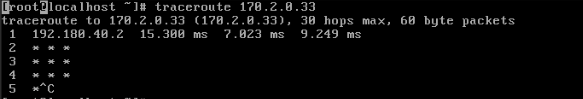


    iii. RCis2 com rota para a rede 170.2.0.0/16 através de RLin (outRes)

        - enable
        - conf t 
        - no ip route 170.2.0.0 255.255.0.0 195.70.40.25
        - ip route 170.2.0.0 255.255.0.0 192.180.40.3
        - show ip route 
        - copy running-config startup-config

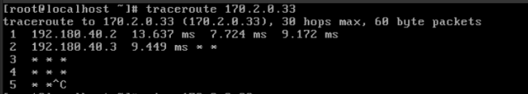

**tentei traceroute -i ens3 170.2.0.33 (mas não deu e penso que devia,porque temos conexão entre Term2 e Term1 via Rlin )**
R: Porque o Term1 tem uma rota para pacotes que querem ir para rede com prefixo 192.180.40.0/24 e como
a rota para essa rede usa o RCis1 e ele esta desligado, não consegue chegar lá (ver figura abaixo, em que mostra
a captura de um ping apartir de Term2 para Term1 e vemos que ele esta a tentar descobrir quem tem o endereço
170.2.0.1).

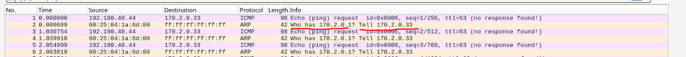

#### g. Tendo em conta os resultados da alínea anterior, seria útil ter encaminhamento dinâmico nos routers para conseguir resposta ao traceroute? Justifique.(texRes)

**Resposta do professor**

    Neste caso o encaminhamento dinamico não nos iria ajudar, porque o problema esta no facto do Term1 ter como gateway o RCis1 para a rede 192.180.40.0/24 , que está desligado.Como os terminais não "falam" encaminhamento dinamico, não se ajustava a mudanças na rede.

#### h. Em RCis2, coloque a rota para a rede 170.2.0.0/16 através de RLin.

**Nota: para iniciar a captura no GNS3 basta clicar na ligação que queremos observar -> clicar com botão direito -> Iniciar wireshark**

    i. Inicie uma captura na ligação de Term2 à sub-rede 192.180.40.0/24; faça traceroute desse terminal para um endereço IP da rede 170.2.0.0/16 ao qual não corresponda nenhuma máquina. Repita o traceroute (a saída deve ser diferente; caso seja igual, repita os dois traceroutes com outro endereço IP). (outRes + capRes)

<br>

    - traceroute 170.2.0.2

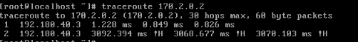
    


    - traceroute 170.2.0.4
    
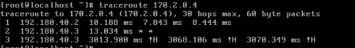

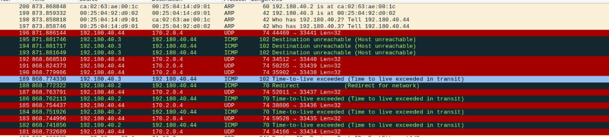

    ii. Por que razão é diferente a saída do traceroute? (texRes)

R: A **primeira vez que fazemos um traceroute** para um terminal não existente da sub-rede 172.2.0.0/16 temos o **redirect** ,que foi feito pelo **RCis2** para **RLin**.Das proximas vezes que tentarmos enviar para o mesmo endereço, como temos o Term2 diretamente conectado a RLin, o **RCis2** diz para enviar diretamente (ver figura seguinte).


> Esquema que explica ```ICMP redirect que ocorre no tracroute``` 
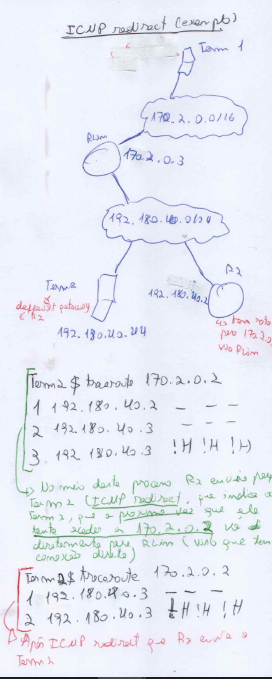


### 2. ARP. Inicie uma captura na ligação de Term2 ao switch da sub-rede 192.180.40.0/24.

#### a. Faça ping -c 1 192.180.40.55 e capture o resultado do ping. (capRes)

    -No wireshark utilizar filtro (icmp or arp) 
    
**Nota**: O Arp faz 3 pedidos antes de devolver o erro ```Host Unreachable```


#### b. Repita a alínea anterior para o endereço 192.180.40.3

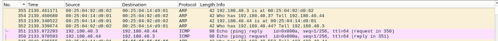


#### c. Comente os pacotes ARP e ICMP capturados nas alíneas anteriores, usando-os para explicar o funcionamento do protocolo ARP (incluindo timeouts e retransmissões). (texRes)

    ARP: Tendo o endereço Ip do vizinho, este protocolo permite descobrir o respetivo endereço MAC

    ICMP: Protocolo associado ao IP para controlo e diagnostico .As mensagens são transportadas diretamente sobre IP

    alinea_a: Vemos o protoclo Arp a tentar descobrir o endereço MAC de 192.180.40.55 (que não consegue descobrir porque maquina não existe). Quanto ao ICMP, ficamos com o erro ICMP-Host Unreachable
    

    alinea_b: Vemos o protoclo Arp a tentar descobrir o endereço MAC de 192.180.40.3 (que é uma interface do Rlin).Após descobrir envia essa informação para o Term2(192.180.40.44).De seguida o processo inverso é feito, ou seja, RLin(192.180.40.3) quer descobrir o endereço MAC do Term2 (192.180.40.44).E por fim temos o sucesso do ICMP


### 3. Faça as capturas indicadas nas alíneas seguintes definindo filtros para 'apanhar' apenas pacotes TCP, com a flag PUSH activa e com um comprimento do pacote IP menor que 128 bytes. Faça ssh do terminal 1 para a interface 192.180.30.44 do terminal 2.

**NOTAS: Pode testar os filtros usando, na shell da máquina remota, a='#'; while true; do echo $a; sleep 1; a=$a'#'; done. Se não conseguir fazer ssh (“connection refused”), vá ao Term2 e corra o seguinte comando como root: systemctl start sshd.service**

    ssh de Term1 para interface 192.180.30.44 do terminal 2.

**Aceder ao utilizador ar via SSH!!**

    


    tcp[tcpflags] and tcp-push != 0 & 0x08 != 0 && ip[2:2] < 128

    tcp[tcpflags] and tcp-push != 0: Captura pacotes TCP com a flag PUSH ativa. A flag PUSH está no 13º byte do cabeçalho TCP, e o valor 0x08 refere-se à flag PUSH.

    ip[2:2] < 128: O comprimento total do pacote IP (indicado no segundo byte do cabeçalho IP) é menor que 128 bytes.


**Utilizei screenshots/comandos da resolução do professor**

#### a.Utilize o tcpdump no Term2, capturando em todas as interfaces (tcpdump -l -n -i any filtro) e indique o filtro usado. (confRes + capRes)

    No Term2
    $ tcpdump -l -n -i any 'tcp[tcpflags] and tcp-push != 0 & ip[2:2] < 128'

    No Term1
    $ ssh ar@192.180.30.44
    $ a='#'; while true; do echo $a; sleep 1; a=$a'#'; done

    (ver no Term2 o que aparece, aparecia muitas mensagens portanto não tirei screenshot)


#### b.Utilize o wireshark com filtro de visualização (captura na ligação de Term1 à rede) e indique o filtro usado. (confRes + capRes)

    filtro wireshark:  tcp.flags.push == 1 && ip.len < 128

    No Term1
    $ ssh ar@192.180.30.44
    $ a='#'; while true; do echo $a; sleep 1; a=$a'#'; done

    (ver no Wireshark, em baixo tem apenas uma print de alguns dos pacotes)
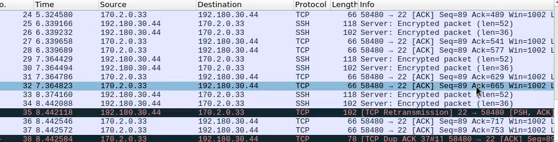

    (com filtro de visualização, ip.len < 128 && tcp.flags.push == 1)
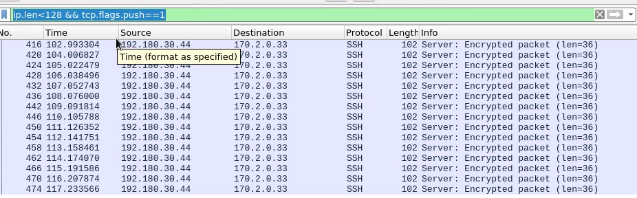


#### c.Como se pode calcular o tamanho do campo de dados no pacote IP? (texRes)

    R: Tamanho do campo de dados pacote Ip= 
    Tamanho Total do Pacote IP − Tamanho do Cabeçalho IP

 
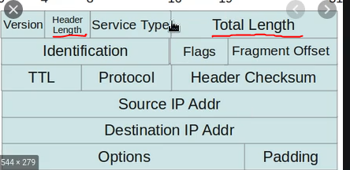