# Notas importantes 

+ ```Modo acesso``` nessa interface que esta configurada com modo acesso **só pode circular pacotes de uma VLAN**

+ ```Modo Trunk``` nessa interface que esta configurada com modo trunk **pode circular pacotes de multiplas VLAN's**

+ Não esquecer de fazer copy running-config startup-config


+ Para criar VLAN's nos ```Switches Cisco IOS```

    + conf t 

    + ```VLAN ID```

# Trabalho 5 - VLAN e (R)STP

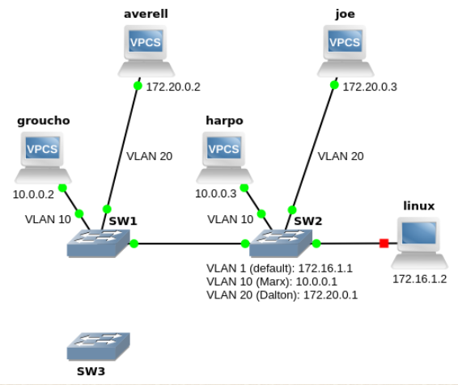

# Questões/Traces/Análise


## 1. Inicie capturas wireshark no groucho e na interface e1/0 de SW2.

## a. Faça um ping de groucho para SW2 e capture o primeiro ICMP Echo Request enviado em ambas as interfaces. As img/imagens das capturas devem ilustrar claramente as diferenças. (2×capRes)

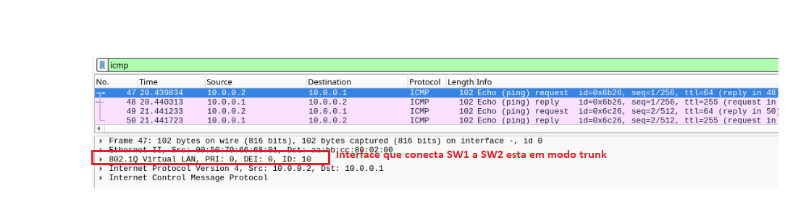

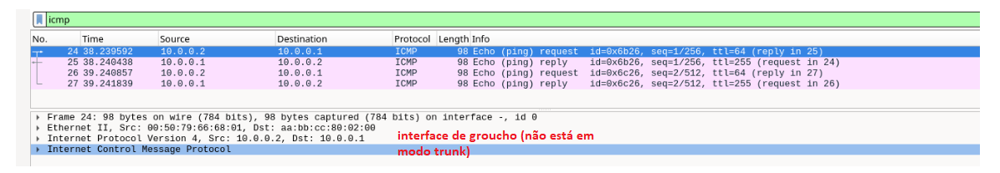


## b. Quais foram as diferenças encontradas e a que se devem? (texRes)

R: As diferenças encontradas foram que no ```ICMP- echo request``` que esta na **ligação entre SW1 e SW2** encontra-se em ```modo trunk``` (tem encapsulamento 802.1Q com varios parametros extra, sendo mais importante VLAN ID), enquanto que a **ligação entre groupcho e SW1** encontra-se em ```modo acesso``` (neste caso, só passa tramas da VLAN 10, devido a configuração feita no Switch)

## 2. Inicie capturas wireshark em groucho e na interface e1/0 de SW2. Altere o endereço IP de averell para 10.0.0.4, que pertence à mesma subnet de groucho ( ip 10.0.0.4/24 10.0.0.1 ). Faça um ping de averell para groucho. Diga o que observa e explique a razão para ser assim. (texRes)


+ Altere o endereço IP de averell para 10.0.0.4, que pertence à mesma subnet de groucho

    + ```ip 10.0.0.4/24 10.0.0.1```

+ Faça um ping de averell para groucho

    + ping 10.0.0.2


> Captura da **interface groucho**

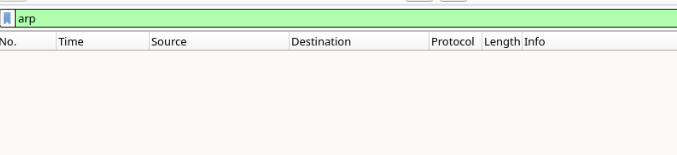

> Captura da **interface avarell**


R: Como **groucho** e **avarell** estão em ```diferentes VLAN```, e portanto estão em diferentes ```redes difusão```, quando **averell** excuta o ping, e tenta descobrir o ```MAC address``` para o endereço ip **10.0.0.2** (groucho) através do ARP.Não obtem resposta, porque dentro da sua ```rede difusão``` não se encontra nenhuma máquina com esse endereço ip.

> Reponha agora o endereço IP original de averell:  ip 172.20.0.2/24 172.20.0.1 


## 3. Apesar de serem dispositivos Layer 2, estes comutadores suportam encaminhamento entre VLAN (função Layer 3). Active o encaminhamento em SW2 (deverá ficar activo para todas as restantes perguntas) e inicie uma captura na sua interface e1/0. Faça um ping de groucho para averell. O que observa em relação aos pacotes ICMP? (capRes + texRes). Use um filtro para mostrar apenas os pacotes relevantes na captura.

> **NOTA**: Ao activar o encaminhamento ( ip routing ) o switch activa automaticamente o CEF, que nesta emulação (imperfeita) impede o encaminhamento de funcionar. Por isso, após activar o encaminhamento, tem que desactivar o CEF: ( no ip cef )


```SW2```

1. conf t
2. ip routing
3. no ip cef
4. end 
5. copy running-config startup-config


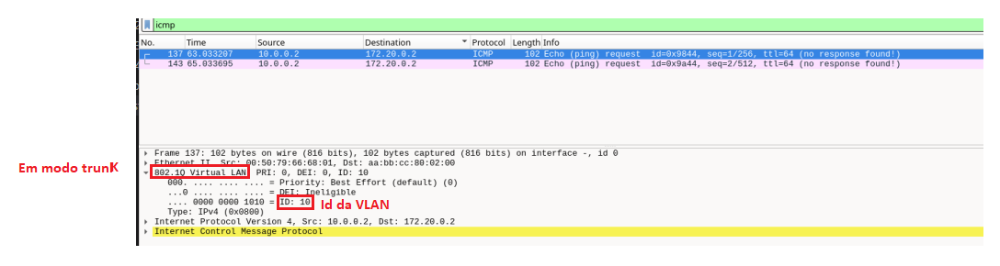


>**Dúvida: porque é que o pacote vai pela interface entre o switch e swicth 2 e não vai direto pelo SW1**

R: Porque configuramos o SW2 como default gateway (**essas configurações foram importados no inicio do trabalho**)


**TODO: CONFIRMAR**

R: Como temos configurado as interfaces que ligam SW1 e SW2 em modo trunk, os pacotes ICMP circulam com norma 802.1Q, e neste caso temos que groupcho pertence a VLAN 10 e averell pertence a VLAN 20, portanto sendo de VLAN diferentes então não estão na mesma ```rede difusão```.


(resposta do professor)

> Ping ```groucho``` para  ```averell```

R: 
 + (PEDIDO) Ao fazer um ping de ```groucho```, o ping vai ao ```SW1``` e depois vai pela ```porta trunk``` (entre ```SW1``` e ```SW2```) até ao ```SW2``` para **gateway** (porque se  trata de um **sub-rede** ```diferente```) e depois a **gateway** reenvia (já na ```VLAN 20```) para o ```averell```. 

 + (RESPOSTA) As respostas vem em sentido contrário, ou seja,  ```averell``` devolve as respostas a ```SW1```, que depois vai enviar para ```SW2``` **gateway**  (porque se  trata de um **sub-rede** ```diferente```). Na **gateway** vamos reenviar (já na ```VLAN 10```) para o ```groucho```

> **NOTA**: Não é possivel haver comunicação ```direta``` entre máquinas que **estão** em ```VLAN's diferentes```, a comunicação tem que ser feita na ```camada superior``` (**camada de rede**) através de um ```router``` (neste caso temos um switch, com capacidade de fazer encaminhamento de pacotes entre VLAN's)

> Resumindo: A **comunicação** entre ```VLAN diferentes``` é ```sempre feito``` utilizando ```Router's``` ou ```dispositivo com capacidades semelhantes de Ip forwarding```


## 4.Faça as alterações necessárias para a ligação entre SW2 e o terminal linux funcionar em modo trunk, adicionando neste último uma interface na VLAN 10 com o endereço IP 10.0.0.5.


### a. Indique as configurações que teve de fazer. (confRes)

```linux```


> Temos de criar uma ```interface lógica``` no **linux**, fazendo o seguinte comando (isto faz configuração não permanente):

```bash
    # O 10 (representa vlan 10) !!!!
    vconfig add ens3 10
    # O 10 (representa vlan 10) !!!!
    ifconfig ens3.10 10.0.0.5 netmask 255.255.255.0  up 
```

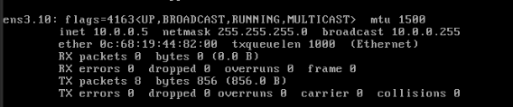

```SW2```

```bash
    interface Ethernet 0/2
    switchport trunk encapsulation dot1q
    switchport mode trunk
```

**NOTA:** para fazer ```trunk``` é necessário ser um ```SWITCH```

### b. Faça uma captura wireshark na interface e0/2 de SW2. A partir do terminal linux faça ping aos endereços de SW2 nas VLAN 1 e 10. Mostre a captura de um pacote de cada um dos pings que ilustre a diferença. (2×capRes)


```Terminal para VLAN 1```

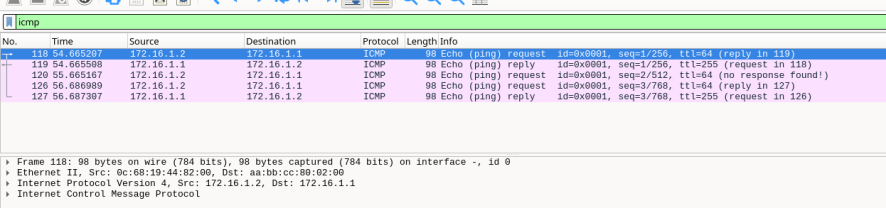


```Terminal para VLAN 10 (harpo)```

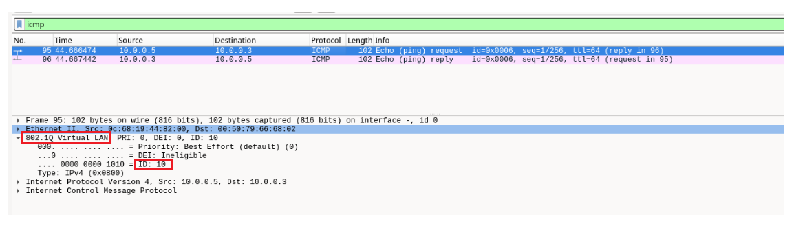


### c. Como explica o que observou na alínea anterior? (texRes)

R: Nos pacotes ICMP de Terminal para VLAN1, o SW2 esta configurado em ```modo acesso```. Nos pacotes ICMP do Terminal para VLAN10, o SW2 está configurado em ```modo trunk``` e aparece nos pacotes norma  802.1Q.

+ ```Acesso```: **Uma VLAN** por **interface** (uso final).

+ ```Trunk```: **Múltiplas VLANs** por **interface** (comunicação entre switches).


> **NOTA: Reponha agora a configuração anterior a esta pergunta (ligação entre SW2 e terminal linux em modo acesso).**

``` bash
    conf t 
    interface Ethernet 0/2
    switchport mode access
    switchport access vlan 10
``` 

## 5. Altere as configurações de SW1 e SW2 de modo a que a ligação entre eles fique em modo acesso na VLAN 10.


```SW1``` e ```SW2```

``` bash
    conf t 
    interface Ethernet 1/0
    switchport mode access
    switchport access vlan 10
``` 

### a. Verifique que consegue fazer ping do groucho para o harpo, mas não do averell para o joe. (outRes)

> Ping de **groucho** para **harpo**

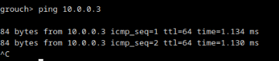

> Ping de **averell** para **joe**

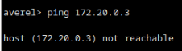

> Basicamente ao colocar a interface que liga ```SW1``` e ```SW2``` em ```modo acesso``` para **VLAN 10**, então são vão circular **tramas** que sejam da **VLAN 10**
 
### b. Altere a configuração de SW2 para que a sua ligação a SW1 fique em modo acesso na VLAN 20 (note que esta ligação fica com VLAN diferentes nas duas pontas). Repita os pings da alínea anterior e verifique que não consegue fazer nenhum deles. Porquê? (texRes) Para compreender melhor o que se passa pode fazer capturas Wireshark em harpo e joe.


```SW2```

``` bash
    conf t 
    interface Ethernet 1/0
    switchport mode access
    switchport access vlan 20
``` 

> Ping de **groucho** para **harpo**

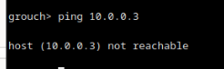

> Ping de **averell** para **joe**

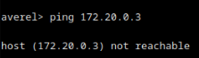


R: (Ver figura com explição abaixo)

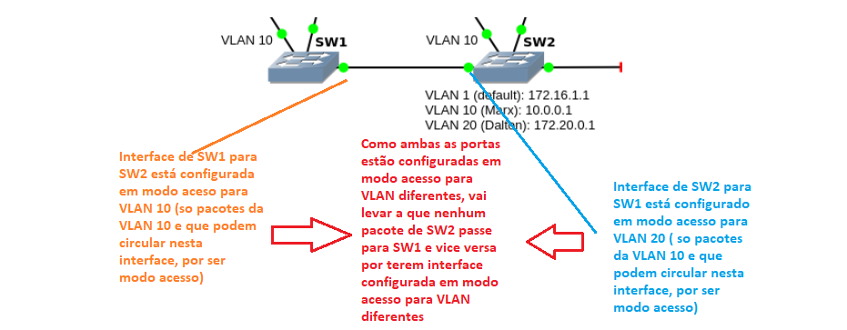

> **NOTA: Reponha agora a configuração anterior a esta pergunta (ligação entre SW1 e SW2 em modo trunk)**


```SW1``` e ```SW2```

```bash
    interface Ethernet 1/0
    switchport trunk encapsulation dot1q
    switchport mode trunk
```


## 6. Crie uma ligação entre as portas e1/1 de SW1 e e1/1 de SW3. Configure as portas em modo trunk. Active a porta e1/1 de SW3.

```SW3```

```bash
    interface Ethernet 1/1
    switchport trunk encapsulation dot1q
    switchport mode trunk
    no shutdown
```

```SW1``` 

```bash
    interface Ethernet 1/1
    switchport trunk encapsulation dot1q
    switchport mode trunk
```


### a.Em SW1, active o debugging de eventos STP usando o comando  debug spanning-tree events  e depois active a porta e1/1. Quanto tempo demorou até chegar ao estado Forwarding? Por que outros estados passou? (texRes)

```SW1```

```bash
    # active o debugging de eventos STP
    debug spanning-tree events

    # Active a porta e1/1
    conf t 
    interface Ethernet 1/1
    no shutdown

```


> O que aparece no SW1 que tem ativado  ```debug spanning-treeevents```

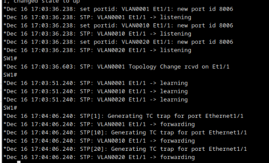


R: Para chegar ao ```estado Forwarding``` demora cerca de **30s** (**15s** no ```estado Listening``` e **15s** no ```estado learning```). Passou por **4 estados** (Blocking -> Listening -> Learning -> Forwarding)


> ```Notas```

+ O ```estado Blocking``` ocorre quando ligamos a interface pela primeira vez (com **no shutdown**)

+ Se a interface desligar ou estiver desativada ela começa no ```estado Disabled```


> Pode desactivar o debugging.

```bash
    no debug spanning-tree events
```

### b. Corra o comando  show spanning-tree vlan 10  em SW1, SW2 e SW3. Qual deles foi eleito Root? Porquê? (texRes)

> show spanning-tree vlan 10 

```SW1```

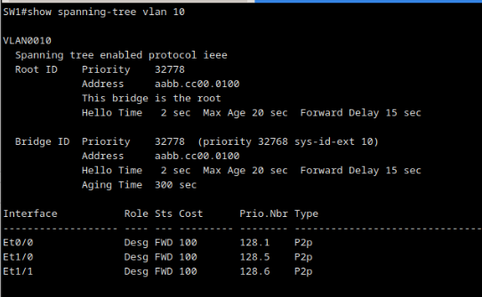

```SW2```

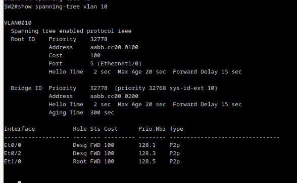

```SW3```
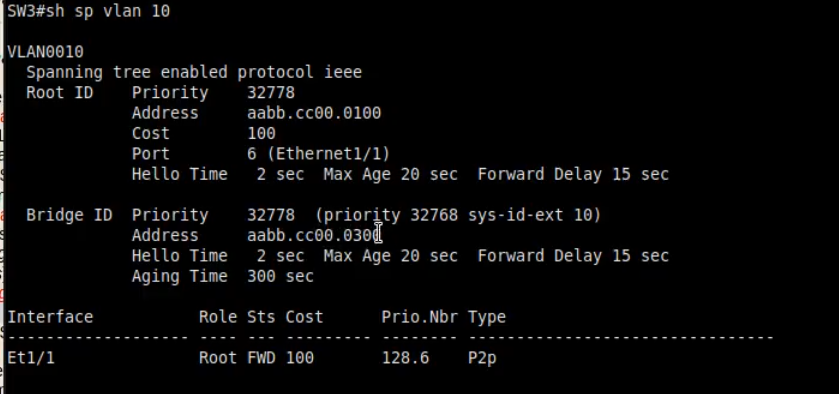

R: O switch eleito como ```root bridge``` foi o **SW1**, porque a eleição do **root bridge** é feita segundo Switch com ```bridge ID mais baixo```. Como ambos os Switches tem a mesma ```Bridge Priority```, então temos que fazer desempate pelo ```MAC ADDRESS```, e como **SW1** tem o menor MAC ADDRESS ele é o escolhido.

> **NOTA:** ```Bridge ID``` ==> [ ```Bridge Priority``` + ```VLAN id```, ```MAC ADDRESS``` ]


### c. Altere a configuração de SW3 de modo a que passe a ser eleito como Root em todas as VLAN (confirme que funcionou). Que comando usou? (confRes)

> Note que SW3 ainda não tinha as VLAN 10 e 20, pelo que tem que as criar neste comutador, caso contrário ele fica Root apenas para a VLAN default.

```SW3```

```bash
    conf t
    vlan 10
```

```bash
    conf t
    vlan 20
```

> Definimos uma prioridade menor que a default para SW3 para garantir que fica eleito como root bridge

``` bash
    conf t 
    
    # Primeira opção
    spanning-tree vlan 10 priority 4096
    spanning-tree vlan 20 priority 4096

    # Segunda opção 
    spanning-tree vlan 1-4094 root primary

    

```

**Demontstração que SW3 ficou como root bridge para**:

+ VLAN 10

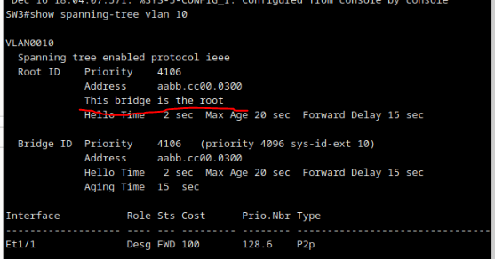

+ VLAN 20

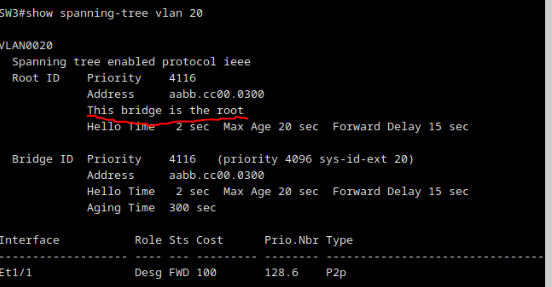

### d. Após a alteração da alínea anterior, qual é o Root Path Cost em cada um dos comutadores? (texRes)


R: O **Root Path Cost** em cada comutador é:


> Verifiquei o parâmetro ```Cost``` associado a cada **VLAN** quando faço ```show spanning-tree``` 

> Cada **ligação** por ```Interface Ethernet``` tem ```custo = 100```

```SW1```

+ VLAN 1 : RPC = 0 (porque é ```Root Bridge```)

+ VLAN 10 : RPC = 100 

+ VLAN 20 : RPC = 100

```SW2```

+ VLAN 1 : RPC = 100

+ VLAN 10 : RPC = 200

+ VLAN 20 : RPC = 200

```SW3```

+ VLAN 1 : RPC = 100 

+ VLAN 10 : RPC = 0 (porque é ```Root Bridge```)

+ VLAN 20 : RPC = 0 (porque é ```Root Bridge```)


## 7. Altere nos três comutadores o modo do protocolo para RSTP:  spanning-tree mode rapid-pvst 

> Em cada um dos switch's

```bash
    conf t
    spanning-tree mode rapid-pvst
```

### a. Acrescente uma nova ligação trunk entre as portas e1/2 de SW2 e e1/2 de SW3, active ambas as portas e aguarde até a topologia estabilizar. Para cada uma das portas de SW1, SW2 e SW3 associadas à VLAN 10 (modo acesso ou trunk), indique a função e estado com que ficou. (texRes)


> Em ambos os Switch's ```SW2``` e ```SW3```
```bash
    conf t
    interface Ethernet 1/2
    switchport trunk encapsulation dot1q
    switchport mode trunk
    no shutdown
```


> Usei comando **show spanning-tree vlan 10**

```SW1```

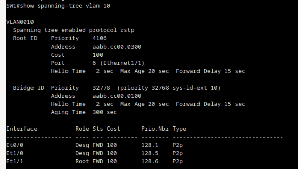

> Temos ```Eth1/1``` (liga **SW1** a **SW2**) como ```Root Port``` e depois temos ```Eth0/0``` (liga **SW1** a **groucho**) e ```Eth1/0``` (liga **SW1** a **SW2**) como ```Designated Port```

```SW2```


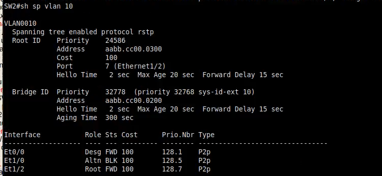

> Temos ```Eth1/2``` (interface que liga SW1 e SW2) que é ```Root port```. Depois temos  ```Eth1/0``` como ```Alternate```, portanto está **bloqueada**. Temos ainda a porta ```Eth0/0``` (liga **SW2** a **harpo**) que está ```Designated Port```

```SW3```

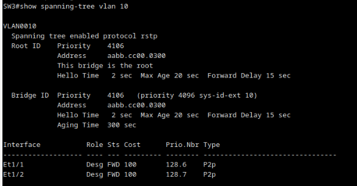

> Este é um ```Root Switch``` portanto todas as suas **portas** vão ficar ```Designated Port```, a menos que haja duas ou mais ligadas a um mesmo segmento de rede (ai apenas uma fica ```Designated Port```, so aconte se usarmos Hub's)


### b. Na ligação entre SW1 e SW2, foi a porta de SW2 que ficou bloqueada. Porquê? (texRes)


R: As portas que não forem necessárias são bloqueadas. No caso,  na ligação entre ```SW1``` e ```SW2```,  ficou **bloqueado** a porta no ```SW2```, porque deixou de ser necessário visto que temos outra forma de chegar s SW2 e ```STP``` determinou que essa porta não é necessária


### c. Que implicações tem o facto de essa porta estar bloqueada na comunicação, por exemplo, entre groucho e harpo? (texRes)

R: A unica implicação é que segue um percurso da arvore criada por STP, porque o facto de porta estar bloqueada não afeta a comunicação entre groucho e harpo, porque existe outro caminho para lá.

> ```Ping de groucho para harpo```

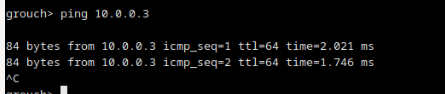


## 8. Em SW2, confirme que a Root Port é a e1/2.


No ```SW2``` fazer ```show spanning-tree``` e verificar parâmetro ```Port```

+ VLAN 10


+ VLAN 20 

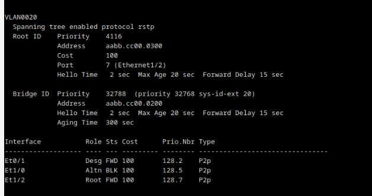

> Na **VLAN 1** a ```root port``` é interface que interliga ```SW1``` a ```SW2```


## a. No groucho, corra o comando  ping 10.0.0.1 -t . Desactive agora a porta e1/2 de SW2 (ligação a SW3), e depois confirme que a Root Port passou a ser e1/0. Notou alguma interrupção no ping? Por que razão foi a activação da nova Root Port em SW2 tão rápida? (texRes)

> Pode parar o ping com CTRL-C.

```SW2```

```bash
    conf t
    interface Ethernet 1/2
    shutdown
```


>confirme que a Root Port passou a ser e1/0


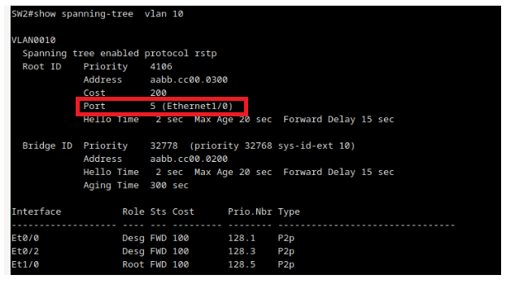

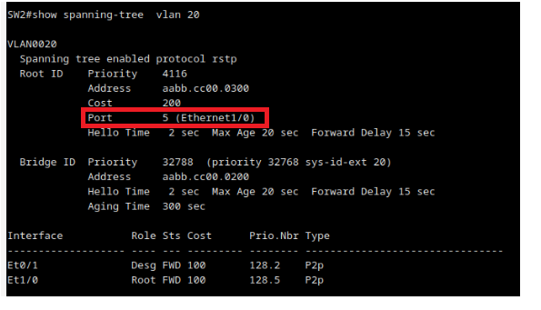


>Notou alguma interrupção no ping?

R: Não ocorreu **nenhuma interrupção no ping**.

>Por que razão foi a activação da nova Root Port em SW2 tão rápida?

(Resposta do professor)
R: A activação da nova Root Port em SW2 tão rápida porque ```Eth1/0``` estava com **cargo** de ```Alternate Port```, este é um mecanismo do ```RSTP``` (**analogo** ao  ```UplinkFast```, que permite recuperar rapidamente da falha do ```Root Port```, porque temos uma ```Root Port alternativa```)
 

### b. Faça agora um ping idêntico de harpo para 10.0.0.1. Volte a activar a porta e1/2 de SW2. Verifique que a interface e0/0 de SW2 deixou de estar Forwarding por cerca de 30s e, em consequência, houve interrupção no ping. Qual é a razão para isto acontecer? (texRes) Para compreender melhor o que se passa, pode fazer uma captura na e0/0 de SW2 e observar as BPDU

```SW2```

```bash
    conf t
    interface Ethernet 1/2
    no shutdown
```

houve interrupção no ping. Qual é a razão para isto acontecer?

(Professor deu uma resposta mais completa, se for precisso ver video)

R: O que acontece a **topologia** da rede ```alterou-se``` e durante essa alteração é enviada ```BPDU change Proposal``` e isso faz que enquanto não é estabalizada a rede, os ping não é sucedido.


### c. Desactive novamente a interface e1/2 de SW2 e deixe o RSTP estabilizar. Configure todas as portas a que estão ligados terminais, incluindo a e0/0 de SW2, como Edge Ports. ( spanning-tree portfast edge ). Repita a alínea anterior e verifique que agora não há interrupção no ping. Explique porquê. (texRes)

>Configure todas as portas a que estão ligados terminais, incluindo a e0/0 de SW2, como Edge Ports.

```Num Switch```

``` bash
    conf t 
    int Ethernet x/y
    spanning-tree portfast edge
    end
```


> ```Ping de Harpo para 10.0.0.1```

R: Basicamente **não há interrupção no Ping**, porque a ```porta``` esta configurada como ```Edge Port```, é automaticamente considerada como sincronizada, portanto não é precisso correr mecanismo de proposal agrement (como esta ligado a um termina, podemos configurar como ```Edge Port``` , porque não existe o risco de esta porta criar o loop, so se tivesse ligado a uma bridge é que poderia criar ciclo)