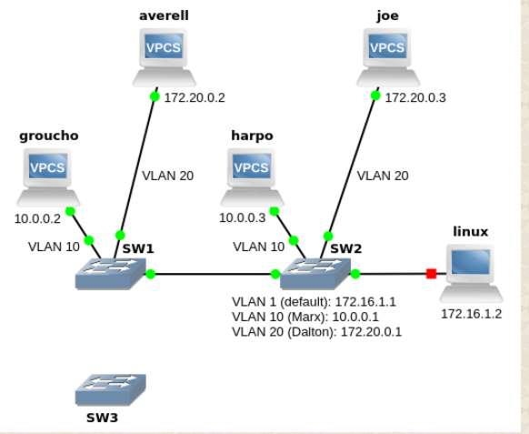
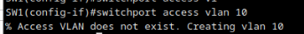
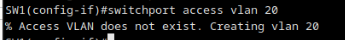
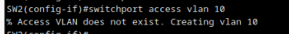
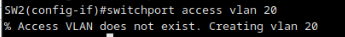
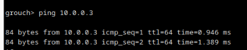
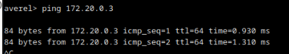
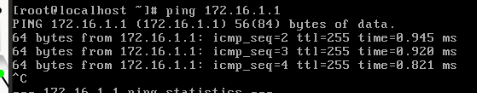
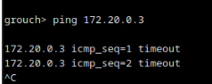

# Configurações iniciais (Trabalho 5 - VLAN e (R)STP)




> Fazer import das configurações iniciais

1. Todas as sub-redes são /24, e os endereços IP configurados em SW2 são a default gateway para as respectivas sub-redes.

2. Todos os terminais excepto o linux são VPCS. Só precisa de configurar o terminal linux, que os restantes já têm todas as configurações necessárias (**endereço IP** e **default gateway**) nas configurações fornecidas.


        Fazer configurações com nmtui


3. No terminal linux deve ter o reenvio de pacotes desactivado (net.ipv4.ip_forward=0).

    ``` bash

        sudo nano /etc/sysctl.conf
        (...)
        net.ipv4.ip_forward = 0
        sysctl -p
    ```

4. Criar e atribuir nomes as **VLAN's** **10** e **20** no ```SW1``` e ```SW2``` (não configuramos ainda aqui)


+ **VLAN 1** (não é precisso, já vem configurado por default)


+ ```SW1```

```bash
    conf t 
    vtp mode transparent # Configurar VLAN's localmente 
    vlan 10 
        name Marx
    vlan 20 
        name Dalton 
```


+ ```SW2```

```bash
    conf t 
    vtp mode transparent  # Configurar VLAN's localmente 
    vlan 10 
        name Marx
    vlan 20 
        name Dalton 
```


4. As portas de SW1 e SW2 às quais estão ligados terminais devem ser configuradas em ```modo de acesso```, na VLAN 10 (groucho e harpo), na VLAN 20 (averell e joe) e na VLAN 1 (linux).

+ ```SW1```

    + ```groupcho```
    
        ``` bash
            conf t 
            interface Ethernet 0/0
            switchport mode access
            switchport access vlan 10
        ```

    >

    +  ```averell```

        ``` bash
            conf t 
            interface Ethernet 0/1
            switchport mode access
            switchport access vlan 20
        ```


    > 

+ ```SW2``` 

    + ```harpo```

    ``` bash
        conf t 
        interface Ethernet 0/0
        switchport mode access
        switchport access vlan 10
    ```
    >

    + ```joe```

    ``` bash
        conf t 
        interface Ethernet 0/1
        switchport mode access
        switchport access vlan 20
    ```

    > 

    + ```linux```

    ``` bash
        conf t 
        interface Ethernet 0/2
        switchport mode access
        switchport access vlan 1
    ```

5. SW2 é o único comutador em que devem ser configurados endereços IP nas diferentes VLAN.


```SW2``` (este precissa de atribuir ip quando define a vlan, porque este switch esta a agir como ```router```)

+ **VLAN 1**

    ```bash
        interface vlan 1
        ip address 172.16.1.1 255.255.255.0
        no shutdown
    ```

+ **VLAN 10**

    ```bash
        interface vlan 10
        ip address 10.0.0.1 255.255.255.0
        no shutdown
    ```

+ **VLAN 20**

    ```bash
        interface vlan 20
        ip address 172.20.0.1 255.255.255.0
        no shutdown
    ```


6. Nos comutadores, todas as portas que não estão em uso estão desactivadas administrativamente (é boa prática).

7. As portas de interligação entre comutadores (inicialmente apenas SW1 e SW2) devem ser configuradas em modo trunk com encapsulamento 802.1Q.

```SW1```

```bash
    interface Ethernet 1/0
    switchport trunk encapsulation dot1q
    switchport mode trunk
```

```SW2```

```bash
    interface Ethernet 1/0
    switchport trunk encapsulation dot1q
    switchport mode trunk
```


8. Inicialmente, SW3 está desligado.

9. Antes de prosseguir deve fazer alguns testes básicos de conectividade:

    + Deve conseguir fazer ping do groucho para o harpo e para a "interface" vlan 10 de SW2.

    > 

    + Deve conseguir fazer ping do averell para o joe e para a "interface" vlan 20 de SW2.

    > 

    + Deve conseguir fazer ping do linux para a "interface" vlan 1 de SW2.

    > 

    + Não deve conseguir fazer ping entre máquinas de VLAN diferentes.


    > ```Ping de groucho para joe```

    > 

10. Em cada ```SWITCH``` fazer ```copy running-config startup-config``` 